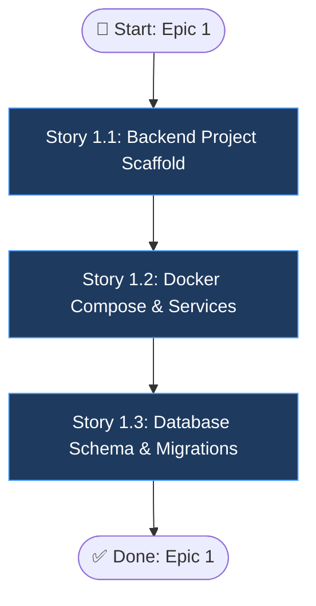

# Epic 1: Infrastructure & Project Setup

## Epic Objective

Thiết lập toàn bộ hạ tầng dự án bao gồm cấu trúc thư mục backend/frontend, cấu hình Docker Compose cho tất cả services (MySQL, Redis, MinIO), database schema, và CI/CD. Đây là nền tảng cốt lõi (Phase 1) để tất cả các epic khác có thể triển khai và tích hợp dễ dàng.

## Flowchart

## Stories

### Story 1.1: Backend Project Scaffold
As a developer,
I want to scaffold the FastAPI backend project with proper folder structure,
so that the team has a standardized codebase to build upon.

#### Acceptance Criteria
1. Cấu trúc `csv_agent_services/backend/app/` với các thư mục `api/`, `core/`, `models/`, `schemas/`, `services/`, `ml/` được thiết lập đúng chuẩn.
2. `main.py` chạy thành công với endpoint `/health` trả về `200 OK`.
3. `config.py` đọc đúng các biến môi trường (env vars) cho Database, Redis, MinIO, JWT secret.

### Story 1.2: Docker Compose & Infrastructure Services
As a developer,
I want all infrastructure services (MySQL, Redis, MinIO) running via Docker Compose,
so that the development environment is reproducible and isolated.

#### Acceptance Criteria
1. Lệnh `docker-compose up` khởi động thành công các container: backend, celery-worker, mysql, redis, minio, frontend.
2. Thiết lập volumes persistent an toàn cho MySQL data để tránh mất dữ liệu khi restart.
3. MinIO console có thể truy cập thành công tại port `9001` từ localhost.

### Story 1.3: Database Schema & Migrations
As a developer,
I want the database schema created via Alembic migrations,
so that schema changes are version-controlled and reproducible across environments.

#### Acceptance Criteria
1. Thiết kế và tạo sẵn 4 bảng chính: `datasets`, `analysis_results`, `reports`, `pipeline_runs`.
2. Lệnh `alembic upgrade head` chạy thành công với MySQL dialect.
3. Các khóa ngoại (Foreign keys) và chỉ mục (Indexes) được thiết lập đúng cấu trúc thiết kế dữ liệu.

## Dependencies
- Không có dependencies. Epic 1 khởi tạo nền tảng từ đầu.

## Additional Notes
- Tất cả cấu hình hạ tầng cần được document đẩy đủ trong file `README.md`.
- File `.env.example` cần chứa các biến môi trường mẫu mặc định để developer mới dễ clone.
- *Lưu ý: Tính năng Authentication (Story 1.4 cũ) đã được chuyển sang Epic 7 (Phase 2).*
