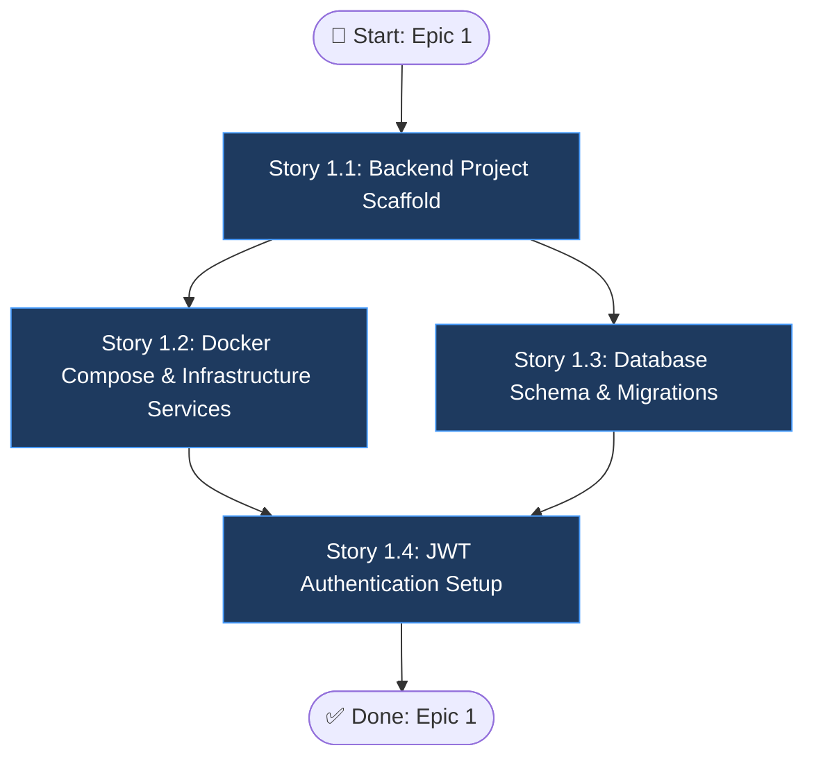

# Epic 1: Infrastructure & Project Setup

## Epic Objective

Thiết lập toàn bộ hạ tầng dự án bao gồm cấu trúc thư mục backend/frontend, Docker Compose cho tất cả services (MySQL, Redis, MinIO), database schema với Alembic migrations, và JWT authentication. Đây là epic nền tảng — tất cả epic khác phụ thuộc vào cơ sở hạ tầng được thiết lập ở đây. Hoàn thành epic này đồng nghĩa với việc môi trường phát triển đã sẵn sàng cho toàn bộ team.

## Flowchart

## Stories

### Story 1.1: Backend Project Scaffold

As a developer,
I want to scaffold the FastAPI backend project with proper folder structure,
so that the team has a standardized codebase to build upon.

#### Acceptance Criteria
1. Cấu trúc `backend/app/` với các package: `api/v1/endpoints/`, `core/`, `models/`, `schemas/`, `services/`, `ml/models/`
2. `main.py` khởi động FastAPI app với CORS middleware, rate limiter
3. Endpoint `GET /health` trả về `{"status": "ok"}` với HTTP 200
4. `config.py` sử dụng Pydantic Settings đọc env vars: `DATABASE_URL`, `REDIS_URL`, `MINIO_ENDPOINT`, `JWT_SECRET`
5. `requirements.txt` bao gồm tất cả dependencies cần thiết (fastapi, uvicorn, sqlalchemy, celery, minio, pyjwt)
6. `.env.example` file mẫu cho tất cả env vars

### Story 1.2: Docker Compose & Infrastructure Services

As a developer,
I want all infrastructure services (MySQL, Redis, MinIO) running via Docker Compose,
so that the development environment is reproducible across all team members.

#### Acceptance Criteria
1. `docker-compose.yml` định nghĩa 6 services: `backend`, `celery-worker`, `mysql`, `redis`, `minio`, `frontend`
2. MySQL 8.0 với volume persistent `mysqldata:/var/lib/mysql`
3. Redis 7 Alpine cho cả cache và Celery broker
4. MinIO với console truy cập tại port `9001`, data API tại port `9000`
5. Backend expose port `8000`, frontend expose port `3000`
6. `docker-compose up` khởi động thành công tất cả services không lỗi
7. Health check configured cho MySQL và Redis

### Story 1.3: Database Schema & Migrations

As a developer,
I want the database schema created via Alembic migrations,
so that schema changes are version-controlled and reproducible.

#### Acceptance Criteria
1. Alembic configured với MySQL dialect (`mysql+pymysql://`)
2. 4 bảng chính được tạo: `users`, `datasets`, `analysis_results`, `reports`, `pipeline_runs`
3. Bảng `datasets`: id (CHAR(36) UUID), filename, file_path, file_size, data_type, row_count, column_count, columns_info (JSON), uploaded_at, user_id (FK)
4. Bảng `analysis_results`: id, dataset_id (FK), model_used, config (JSON), total_anomalies, anomaly_ratio, scores (JSON), metrics (JSON), duration_seconds, created_at
5. Bảng `reports`: id, analysis_id (FK), language, content (TEXT), pdf_path, created_at
6. Bảng `pipeline_runs`: id, dataset_id (FK), status, current_step, config (JSON), result_id (FK), report_id (FK), started_at, completed_at, error_message
7. `alembic upgrade head` chạy thành công, `alembic downgrade -1` rollback đúng
8. Indexes trên các foreign key columns

### Story 1.4: JWT Authentication Setup

As a user,
I want to register and login with JWT authentication,
so that my data and analysis results are secured.

#### Acceptance Criteria
1. SQLAlchemy model `User` với fields: id, email (unique), hashed_password, full_name, created_at
2. `POST /auth/register` tạo user mới, hash password với bcrypt, trả về user info (không password)
3. `POST /auth/login` verify credentials, trả về `{"access_token": "...", "token_type": "bearer"}`
4. JWT token chứa `user_id` và `exp`, signed với `JWT_SECRET`
5. Dependency `get_current_user()` extract và verify token từ `Authorization: Bearer` header
6. Protected endpoints trả `401 Unauthorized` khi không có token hoặc token hết hạn
7. Token expiry configurable qua env var `JWT_EXPIRY_MINUTES` (default: 60)

## Dependencies
- Không có dependency với epic khác (đây là epic đầu tiên)
- Yêu cầu Docker và Docker Compose đã cài trên máy phát triển

## Additional Notes
- Frontend scaffold (Next.js) sẽ được khởi tạo cơ bản trong Docker nhưng chi tiết UI thuộc Epic 6
- CI/CD pipeline (GitHub Actions) có thể thêm sau khi core infrastructure ổn định
- `.env` file KHÔNG được commit vào repository
