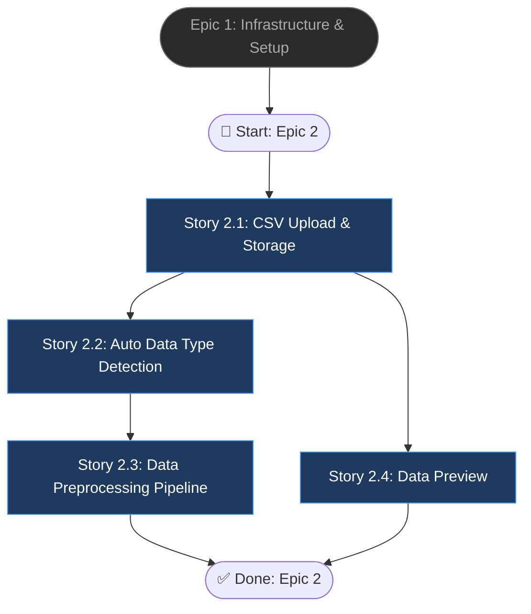

# Epic 2: Data Ingestion & Processing

## Epic Objective

Phát triển module tính năng cho phép người dùng upload file CSV (tới 100MB), hệ thống tự động nhận diện loại dữ liệu (tabular/time-series/mixed), sau đó thực hiện tiền xử lý dữ liệu (cleaning, encoding, scaling) và lưu trữ trực tiếp vào MinIO. Đồng thời cung cấp API trả về data preview để người dùng xác thực thông tin.

## Flowchart

## Stories

### Story 2.1: CSV Upload & Storage
As a user,
I want to upload a CSV file through the API,
so that my data is stored securely for analysis.

#### Acceptance Criteria
1. Endpoint `POST /api/v1/upload` tiếp nhận file CSV multipart và lưu trực tiếp vào MinIO bucket.
2. Metadata thông tin cơ bản (filename, size, row_count, column_count, columns_info) được hệ thống ghi vào bảng `datasets` trong MySQL.
3. Cung cấp lại `dataset_id` trong phản hồi để sử dụng ở các bước tiếp theo.
4. Trả về lỗi `400 Bad Request` nếu file type không phải CSV hoặc dung lượng vượt quá giới hạn 100MB.

### Story 2.2: Auto Data Type Detection
As a user,
I want the system to automatically detect if my data is tabular, time-series or mixed,
so that the appropriate AI model is selected implicitly.

#### Acceptance Criteria
1. Hệ thống `DataService.detect_data_type()` tự động phân loại chính xác 3 loại dữ liệu: `tabular`, `timeseries`, `mixed`.
2. Lưu kết quả nội dung nhận diện vào cột `data_type` của bản ghi dataset trong bảng `datasets`.
3. Thuật toán nhận diện dựa trên phân tích đặc trưng các cột dữ liệu (ví dụ: có mặt cột datetime, sequential ID patterns).

### Story 2.3: Data Preprocessing Pipeline
As a user,
I want my data to be automatically cleaned and preprocessed,
so that it's ready for anomaly detection inference.

#### Acceptance Criteria
1. Module `DataService.preprocess()` thực hiện đầy đủ các bước chuẩn hóa cơ bản: xử lý missing values, mã hóa categorical (encoding), căn chỉnh tỉ lệ numeric (scaling).
2. Tạo object `PreprocessResult` chứa summary chi tiết: danh sách cột processed, số hàng bị bỏ đi do lỗi/rỗng, và các thuật toán transform đã được sử dụng.
3. Dữ liệu chuẩn hoá xử lý sau cùng được gán lưu lại MinIO thành một file processed CSV (khác với gốc).

### Story 2.4: Data Preview
As a user,
I want to preview the first 10 rows of my uploaded data,
so that I can verify the data was uploaded and parsed correctly.

#### Acceptance Criteria
1. Endpoint `GET /api/v1/upload/{id}/preview` truy xuất head dữ liệu, trả về JSON bao gồm 10 dòng đầu kèm column data typings.
2. Response bao gồm thêm loại data type hệ thống đã tự động detect ra và thông tin column statistics cơ bản.
3. Trả về `404 Not Found` nếu truyền thông số `dataset_id` không tồn tại.

## Dependencies
- Epic 1: Backend Setup, MySQL Database, và MinIO bucket.
- Endpoint cần giao tiếp đồng bộ với Microservice API backend FastAPI.

## Additional Notes
- Việc giới hạn kích cỡ tối đa file CSV ở mức 100MB (≈ 1 triệu dòng) tương thích với khả năng xử lý hiện tại và requirement trong PRD. Tối ưu performance I/O cực kỳ quan trọng ở luồng này.
