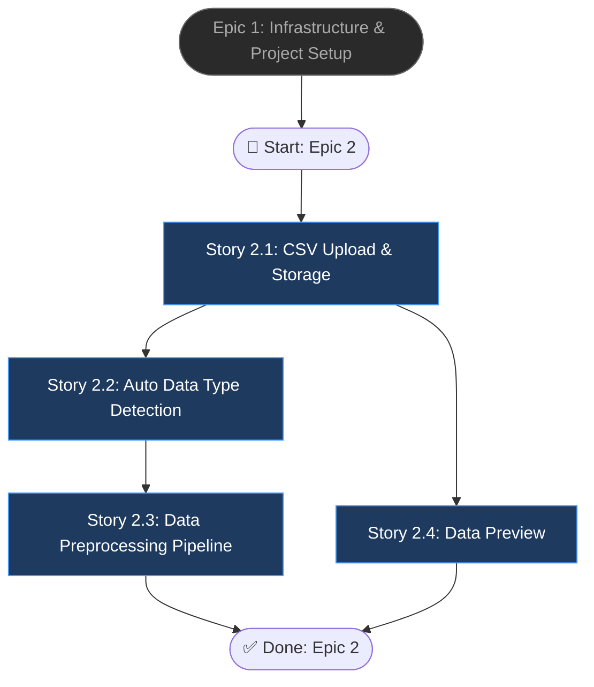

# Epic 2: Data Ingestion & Processing

## Epic Objective

Cho phép người dùng upload file CSV, hệ thống tự động nhận diện loại dữ liệu (tabular/timeseries/mixed), tiền xử lý dữ liệu (clean, encode, scale), và lưu trữ vào MinIO. Epic này xây dựng `DataService` — service cốt lõi cung cấp dữ liệu sạch cho AI models ở Epic 3. Không có data ingestion tốt, anomaly detection sẽ không chính xác.

## Flowchart

## Stories

### Story 2.1: CSV Upload & Storage

As a user,
I want to upload a CSV file through the API,
so that my data is stored securely for analysis.

#### Acceptance Criteria
1. `POST /api/v1/upload` nhận file CSV qua `multipart/form-data`
2. Validation: reject file > 100MB, reject file không phải `.csv` extension
3. File lưu vào MinIO bucket `datasets` với key `{user_id}/{dataset_id}/{filename}`
4. Metadata lưu vào bảng `datasets`: filename, file_path, file_size, row_count, column_count, columns_info (JSON chứa name, dtype, null_count, unique_count per column)
5. Response trả về `dataset_id` (UUID) và metadata summary
6. Trả `413 Payload Too Large` nếu file quá lớn
7. Trả `422 Unprocessable Entity` nếu CSV parse thất bại

### Story 2.2: Auto Data Type Detection

As a user,
I want the system to automatically detect if my data is tabular, time-series or mixed,
so that the appropriate AI model is selected.

#### Acceptance Criteria
1. `DataService.detect_data_type(dataset_id)` phân tích columns và trả về: `tabular`, `timeseries`, hoặc `mixed`
2. Logic detection: nếu có ≥ 1 datetime column VÀ data có sequential ordering → `timeseries`; nếu chỉ có numeric/categorical → `tabular`; nếu kết hợp → `mixed`
3. Kết quả lưu vào field `data_type` của bảng `datasets`
4. Detection chạy tự động sau khi upload thành công
5. Confidence score cho detection result (0.0 - 1.0)

### Story 2.3: Data Preprocessing Pipeline

As a user,
I want my data to be automatically cleaned and preprocessed,
so that it's ready for anomaly detection.

#### Acceptance Criteria
1. `DataService.preprocess(dataset_id)` thực hiện pipeline: missing values → encoding → scaling
2. Missing values: drop rows nếu > 50% null, else fill với median (numeric) hoặc mode (categorical)
3. Categorical encoding: LabelEncoder cho low-cardinality (< 10 unique), one-hot cho medium (10-50), drop cho high (> 50)
4. Numeric scaling: StandardScaler (z-score normalization)
5. `PreprocessResult` chứa: columns_processed, rows_before, rows_after, transformations_applied (list)
6. Dữ liệu đã xử lý lưu vào MinIO: `{user_id}/{dataset_id}/processed.csv`
7. Scaler và encoder objects lưu lại để có thể inverse transform

### Story 2.4: Data Preview

As a user,
I want to preview the first 10 rows of my uploaded data,
so that I can verify the data was uploaded correctly.

#### Acceptance Criteria
1. `GET /api/v1/upload/{id}/preview` trả về JSON với 10 dòng đầu
2. Response format: `{columns: [...], rows: [[...], ...], data_type: "tabular", stats: {column_name: {min, max, mean, null_count}}}`
3. Trả `404 Not Found` nếu dataset_id không tồn tại
4. Trả `403 Forbidden` nếu dataset không thuộc current user
5. Optional query param `?rows=N` để thay đổi số dòng preview (max 100)

## Dependencies
- **Epic 1** phải hoàn thành: cần Docker (MinIO), Database (MySQL), Auth (JWT)
- MinIO bucket `datasets` phải được tạo sẵn

## Additional Notes
- Preprocessing pipeline sẽ được wrap thành Celery task ở Epic 5
- Column statistics được cache trong `columns_info` JSON field để tránh re-compute
- Giới hạn 100MB là soft limit, có thể điều chỉnh qua config
