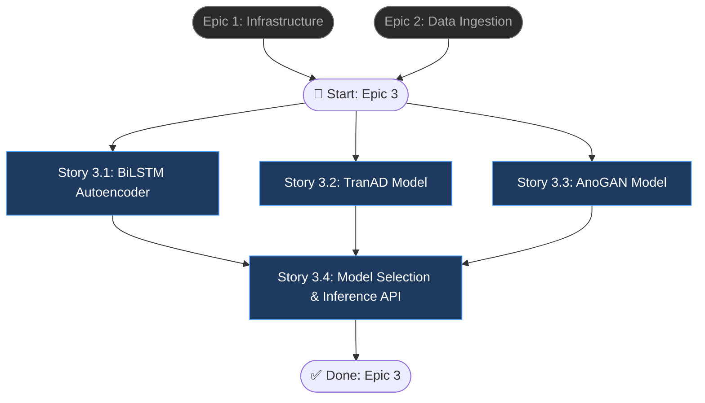

# Epic 3: AI Anomaly Detection Engine

## Epic Objective

Triển khai 3 model deep learning (BiLSTM Autoencoder, TranAD, AnoGAN) để phát hiện dị thường trên dữ liệu CSV. Hệ thống tự động chọn model phù hợp dựa trên loại dữ liệu đã detect ở Epic 2, chạy inference, và trả về anomaly scores kèm chi tiết per-row. Đây là core AI engine — trái tim của toàn bộ platform.

## Flowchart

## Stories

### Story 3.1: BiLSTM Autoencoder Integration

As a data analyst,
I want to run BiLSTM Autoencoder on time-series data,
so that temporal anomalies are detected accurately.

#### Acceptance Criteria
1. `ml/models/bilstm_autoencoder.py` implement `BiLSTMAutoencoder` class kế thừa `BaseAnomalyModel`
2. `load_model(weights_path)` load pretrained weights từ file `.pth`
3. `predict(data: np.ndarray) -> AnomalyScores` chạy inference và trả về scores per row
4. Sliding window approach cho time-series: window_size configurable (default: 50)
5. Anomaly threshold tự động: mean + 2*std của reconstruction errors
6. Support input shape: `(batch_size, sequence_length, n_features)`
7. Model inference chạy trên CPU (GPU optional)

### Story 3.2: TranAD Model Integration

As a data analyst,
I want to run TranAD model for transformer-based anomaly detection,
so that complex temporal patterns are captured.

#### Acceptance Criteria
1. `ml/models/tranad.py` implement `TranAD` class kế thừa `BaseAnomalyModel`
2. `load_model(weights_path)` load pretrained transformer weights
3. `predict(data: np.ndarray) -> AnomalyScores` chạy inference
4. Support multivariate time-series: multiple feature columns simultaneously
5. Attention weights trích xuất để giải thích feature importance per anomaly
6. Trả về `AnomalyScores` với `feature_importance: dict[str, float]` per anomaly row
7. Window-based scoring với configurable window size

### Story 3.3: AnoGAN Model Integration

As a data analyst,
I want to run AnoGAN for GAN-based anomaly detection on tabular data,
so that non-temporal anomalies are found.

#### Acceptance Criteria
1. `ml/models/anogan.py` implement `AnoGAN` class kế thừa `BaseAnomalyModel`
2. `load_model(weights_path)` load pretrained Generator và Discriminator weights
3. `predict(data: np.ndarray) -> AnomalyScores` tính anomaly score = reconstruction_loss + discrimination_loss
4. Hỗ trợ tabular data (no temporal dependency)
5. GAN-based data balancing: nếu positive/negative ratio < 0.1, generate synthetic samples
6. Anomaly score normalized về [0, 1] range
7. Batch inference hỗ trợ dataset lớn (> 100K rows)

### Story 3.4: Model Selection & Inference API

As a user,
I want the system to automatically select the best model based on data type,
so that I get optimal detection results without manual configuration.

#### Acceptance Criteria
1. `AIService.select_model(data_type)` mapping: `timeseries` → BiLSTM/TranAD (configurable), `tabular` → AnoGAN, `mixed` → ensemble
2. `POST /api/v1/analysis/detect` body: `{dataset_id, model_override?: string, config?: object}`
3. Endpoint chạy: load data → select model → preprocess (if not done) → inference → save results
4. Kết quả lưu vào bảng `analysis_results` với: model_used, total_anomalies, anomaly_ratio, scores (JSON), metrics, duration_seconds
5. `GET /api/v1/analysis/{id}/results` trả về full results bao gồm per-row details: `[{row_idx, score, is_anomaly, contributing_features}]`
6. Metrics calculated: precision, recall, f1_score, auc_roc (nếu có ground truth labels)
7. `model_override` cho phép user chọn model cụ thể thay vì auto-select

## Dependencies
- **Epic 1**: Infrastructure, Database, Auth
- **Epic 2**: DataService (uploaded & preprocessed data)
- Pretrained model weights phải có sẵn (huấn luyện riêng hoặc download)
- PyTorch 2.x installed trong Docker image

## Additional Notes
- `BaseAnomalyModel` abstract class định nghĩa interface chung: `load_model()`, `predict()`, `get_threshold()`
- Model Registry (`ml/model_registry.py`) quản lý versioning và loading
- Stories 3.1, 3.2, 3.3 có thể phát triển song song (parallel tracks)
- Inference time target: < 30s cho dataset 100K rows
- Nếu chưa có pretrained weights, cần training pipeline riêng (out of scope cho epic này)
