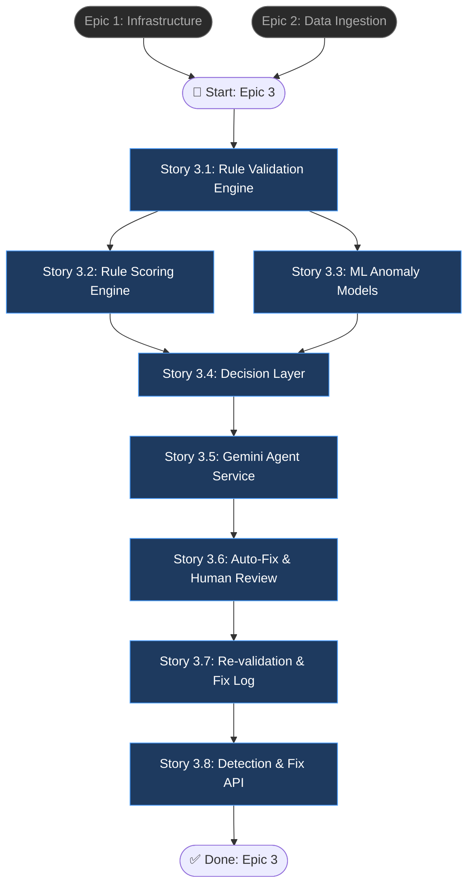

# Epic 3: AI Anomaly Detection & Auto-Fix Engine

## Epic Objective

Xây dựng hệ thống phát hiện dị thường 3 lớp: **Rule Validation (deterministic)** → **Rule Scoring (semi-soft)** → **ML Anomaly Detection (learned patterns)**, kết hợp **Gemini AI Agent** để tự động đề xuất sửa lỗi. Business rules là gate chính (PRIMARY), ML anomaly detect những gì rules không cover (SECONDARY). Sau khi detect, **AI Agent gợi ý fix** → **Auto-fix hoặc Human Review** → **Re-validate bằng Rule Engine** → **Final Clean Data**. Đây là core engine — trái tim của platform, bao gồm cả detect VÀ fix pipeline.

## Architecture Overview

```
        CSV INPUT (from Epic 2)
             ↓
    ┌─── Layer 1: Rule Validation ───┐
    │  Hard fail checks (deterministic) │
    │  missing, datatype, business logic │
    └──────────┬────────────────────────┘
               ↓
    ┌─── Layer 2: Rule Scoring ──────┐
    │  Soft rules (semi-soft)           │
    │  warnings, suspicious values      │
    │  rule_score: 0.0 - 1.0           │
    └──────────┬────────────────────────┘
               ↓
    ┌─── Layer 3: ML Anomaly Models ─┐
    │  XGBoost CLEAN (F1=0.88)         │
    │  DAE + Mahalanobis (unsupervised)│
    │  A9 Ensemble (stacking)          │
    └──────────┬────────────────────────┘
               ↓
    ┌─── Decision Layer ─────────────┐
    │  hard_fail → reject              │
    │  soft_high OR anomaly_high       │
    │    → flag_for_review             │
    │  else → accept                   │
    └──────────┬────────────────────────┘
               ↓
    ┌─── Gemini Agent Service ───────┐
    │  Batch errors → Gemini 1.5 Flash │
    │  Suggest fix with confidence     │
    │  Cache repeated patterns         │
    └──────────┬────────────────────────┘
               ↓
    ┌─── Auto-Fix / Human Review ────┐
    │  confidence > 0.9 → auto apply   │
    │  confidence ≤ 0.9 → human review │
    └──────────┬────────────────────────┘
               ↓
    ┌─── Re-validation (Rule Engine) ┐
    │  Fixed rows → Rule Engine again  │
    │  Pass → Final Data               │
    │  Fail → back to Agent/Review     │
    └──────────┬────────────────────────┘
               ↓
         FINAL CLEAN DATA
```

## Flowchart


```mermaid
flowchart TD
    P1(["Epic 1: Infrastructure"]):::prev --> A
    P2(["Epic 2: Data Ingestion"]):::prev --> A
    A(["🚀 Start: Epic 3"]) --> B["Story 3.1: Rule Validation Engine"]
    B --> C["Story 3.2: Rule Scoring Engine"]
    B --> D["Story 3.3: ML Anomaly Models"]
    C --> E["Story 3.4: Decision Layer"]
    D --> E
    E --> F["Story 3.5: Gemini Agent Service"]
    F --> G["Story 3.6: Auto-Fix & Human Review"]
    G --> H["Story 3.7: Re-validation & Fix Log"]
    H --> I["Story 3.8: Detection & Fix API"]
    I --> J(["✅ Done: Epic 3"])

    B:::story
    C:::story
    D:::story
    E:::story
    F:::story
    G:::story
    H:::story
    I:::story
    classDef story fill:#1e3a5f,stroke:#4a9eff,color:#fff
    classDef prev fill:#2a2a2a,stroke:#666,color:#aaa
```

## Stories

### Story 3.1: Rule Validation Engine (Layer 1 — Hard Rules)

As a data analyst,
I want the system to validate each CSV row against deterministic business rules,
so that obvious data errors are caught immediately before any ML processing.

#### Acceptance Criteria
1. `{ai_services_detection}/src/rules/rule_engine.py` implement `RuleValidationEngine` class
2. Rules loaded từ config file (`rules/validation_rules.yaml`) — config-driven, không hardcode
3. Hard fail checks bao gồm:
   - Missing required fields (null, empty)
   - Datatype mismatch (string vs number)
   - Enum validation (status, type phải nằm trong allowed values)
   - Business logic: `transaction_price > 0`, `lease_expiry_date > lease_start_date`, `commission <= transaction_price`
   - Dependency rules: có `lease` → phải có `lease_duration`, có `sale` → phải có `completion_date`
4. Output per row: `{"row_id": int, "errors": [{"field": "price", "error_type": "missing_value", "message": "..."}], "severity": "hard_fail" | "warning"}`
5. `validate(dataframe) -> ValidationResult` xử lý toàn bộ dataset, trả về list of row errors
6. Performance: validate 100K rows < 10 giây
7. Rules YAML format dễ thêm/sửa rule mới mà không cần đổi code
8. Error output phải đủ chi tiết để Gemini Agent (Story 3.5) có thể hiểu và suggest fix

### Story 3.2: Rule Scoring Engine (Layer 2 — Soft Rules)

As a data analyst,
I want each row to receive a risk score based on soft rules,
so that suspicious but not invalid rows are flagged for further ML analysis.

#### Acceptance Criteria
1. `{ai_services_detection}/src/rules/rule_scorer.py` implement `RuleScoringEngine` class
2. Soft rules loaded từ config file (`rules/scoring_rules.yaml`)
3. Scoring checks bao gồm:
   - Missing optional fields → small penalty (e.g., +0.1)
   - Value hơi lệch khỏi expected range → suspicious score
   - Low frequency patterns (rare landlord, rare postal code) → higher score
   - Unusual combinations (e.g., very high commission with very low price)
4. Output per row: `{"row_id": int, "rule_score": 0.0-1.0, "warnings": ["low_freq_landlord", "suspicious_commission"]}`
5. `rule_score` normalized về [0, 1] — 0 = bình thường, 1 = rất suspicious
6. Rule scores có thể được chuyển thành features cho ML Layer 3 (rule-to-feature bridge)
7. Configurable scoring weights per rule type

### Story 3.3: ML Anomaly Detection Models (Layer 3)

As a data analyst,
I want ML models to detect anomalies that deterministic rules cannot cover,
so that subtle and complex patterns (regional outliers, rare feature combinations) are caught.

#### Acceptance Criteria
1. `{ai_services_detection}/src/models/` implement 3 model classes kế thừa `BaseAnomalyModel`:
   - `xgboost_detector.py` — XGBoost CLEAN (primary model, V9 F1=0.88, 48 features without proxy)
   - `dae_detector.py` — DAE + Mahalanobis scoring (unsupervised baseline, latent_dim=16)
   - `ensemble_detector.py` — A9 Ensemble stacking (DAE + SemiSup + XGBoost, auto-exclude harmful components)
2. `load_model(weights_path)` load pretrained V9 weights từ `.pt` files
3. `predict(data: np.ndarray) -> AnomalyScores` trả về anomaly scores per row
4. XGBoost: feature importance per prediction (contributing_features)
5. Ensemble: threshold = 0.899 (V9 optimized, nested val split)
6. `BaseAnomalyModel` interface: `load_model()`, `predict()`, `get_threshold()`, `get_feature_importance()`
7. Model inference trên CPU (GPU optional), target < 30s cho 100K rows
8. Rule scores từ Layer 2 có thể được thêm vào feature set cho ML models

### Story 3.4: Decision Layer & Deduplication

As a system administrator,
I want a unified decision layer that combines rule and ML results,
so that each row gets a single, consistent verdict (reject / flag / accept) and errors are routed to the AI Agent for fix suggestions.

#### Acceptance Criteria
1. `{ai_services_detection}/src/decision/decision_engine.py` implement `DecisionEngine` class
2. Decision logic (configurable thresholds):
   - `hard_fail` (from Layer 1) → **reject** (immediate, queue for Agent fix)
   - `rule_score >= 0.7 OR anomaly_score >= threshold` → **flag_for_review** (queue for Agent fix)
   - Else → **accept**
3. Deduplication: nếu rule VÀ ML cùng flag 1 row, giữ rule reason là primary, ML reason là supporting evidence
4. Output per row:
   ```json
   {
     "row_id": 1,
     "decision": "reject|flag|accept",
     "rule_errors": [{"field": "price", "error_type": "missing_value"}],
     "rule_score": 0.85,
     "anomaly_score": 0.92,
     "reasons": ["missing_price", "outlier_commission"],
     "needs_fix": true
   }
   ```
5. Decision thresholds configurable qua config file (không hardcode)
6. `get_fixable_rows()` trả về tất cả rows cần fix (reject + flagged) kèm error context — đây là input cho Gemini Agent
7. Summary statistics: total_rejected, total_flagged, total_accepted, total_needs_fix, anomaly_ratio

### Story 3.5: Gemini Agent Service (AI Fix Suggestion Engine)

As a data analyst,
I want an AI agent powered by Gemini to suggest corrections for detected errors,
so that data issues are fixed intelligently instead of just being flagged.

#### Acceptance Criteria
1. `{ai_services_detection}/src/agent/gemini_agent.py` implement `GeminiAgentService` class
2. Model: **Gemini 1.5 Flash** (rẻ + nhanh, tối ưu cho batch processing)
3. Prompt design với system prompt:
   ```
   You are a data cleaning assistant.
   Given: A CSV row, validation errors, context data.
   Task: 1. Suggest corrected values. 2. Do NOT hallucinate if unsure. 3. Return JSON only.
   Rules: Preserve original meaning. If confidence < 0.7 → set fix_type = "manual".
   ```
4. Input format — **batch request** (KHÔNG call từng row):
   ```json
   {
     "rows": [
       {"row_id": 1, "row_data": {"field": "value"}, "errors": [{"field": "...", "error_type": "..."}]},
       {"row_id": 2, "row_data": {"field": "value"}, "errors": [...]}
     ],
     "context": {"dataset_type": "sale", "valid_enums": {...}}
   }
   ```
5. Output format per suggestion:
   ```json
   {
     "suggestions": [
       {
         "row_id": 1,
         "field": "transaction_type",
         "original_value": "rentl",
         "suggested_value": "rental",
         "confidence": 0.95,
         "fix_type": "auto",
         "reason": "Closest valid enum"
       }
     ]
   }
   ```
6. **Token reduction**: chỉ gửi error fields + context tối thiểu, không gửi full CSV row nếu không cần
7. **Cache layer**: `{ai_services_detection}/src/agent/fix_cache.py` — cache mapping `(field, error_type, original_value) → suggested_value` trong Redis
   - VD: `"rentl" → "rental"` được cache → lần sau không cần gọi Gemini
   - Cache hit rate target: > 40% sau 1000 rows processed
8. **Rate limiting & retry**: exponential backoff khi Gemini API rate limit
9. Batch size configurable (default: 20 rows/request) để tối ưu cost
10. API endpoint: `POST /api/v1/agent/suggest-fix` nhận batch rows + errors, trả về suggestions

### Story 3.6: Auto-Fix Engine & Human Review Queue

As a data analyst,
I want high-confidence fixes applied automatically and low-confidence fixes sent to human review,
so that data is corrected efficiently while maintaining accuracy.

#### Acceptance Criteria
1. `{ai_services_detection}/src/agent/auto_fix_engine.py` implement `AutoFixEngine` class
2. Auto-fix logic:
   ```python
   if confidence >= 0.9 and fix_type == "auto":
       apply_fix(row, suggestion)  # Auto-apply
   else:
       send_to_review(row, suggestion)  # Human review queue
   ```
3. `apply_fix(row, suggestion)` cập nhật giá trị trong dataset, log vào `data_fix_log`
4. `send_to_review(row, suggestion)` thêm vào review queue với status `pending_review`
5. Review queue API:
   - `GET /api/v1/review/pending` — list pending fixes (paginated)
   - `POST /api/v1/review/{fix_id}/approve` — approve fix, apply and log
   - `POST /api/v1/review/{fix_id}/reject` — reject suggestion, mark as `rejected`
   - `POST /api/v1/review/{fix_id}/override` — human provides custom fix value
6. Batch approve: `POST /api/v1/review/batch-approve` nhận list fix_ids
7. Confidence threshold configurable (default: 0.9) qua config file
8. Dashboard-ready response format: mỗi pending fix chứa original_value, suggested_value, confidence, reason, row context

### Story 3.7: Re-validation Loop & Data Fix Log

As a system administrator,
I want all fixed rows to be re-validated by the Rule Engine and all fix actions logged,
so that fixes are verified correct and there is a complete audit trail.

#### Acceptance Criteria
1. `{ai_services_detection}/src/agent/revalidation.py` implement `RevalidationService` class
2. **Re-validation loop**: sau mỗi fix (auto hoặc approved):
   ```
   Fixed Row → Rule Engine (Story 3.1) → Validate lại
   ├── Pass → mark as "fixed_verified", move to Final Data
   └── Fail → mark as "fix_failed", re-queue for Agent hoặc manual review
   ```
3. Max re-validation attempts configurable (default: 3) — tránh infinite loop
4. Nếu max attempts reached → mark as `requires_manual_intervention`
5. **Data Fix Log** — bảng `data_fix_log` trong database:
   ```sql
   CREATE TABLE data_fix_log (
     id INT AUTO_INCREMENT PRIMARY KEY,
     dataset_id VARCHAR(36) NOT NULL,
     row_id INT NOT NULL,
     field VARCHAR(100) NOT NULL,
     original_value TEXT,
     fixed_value TEXT,
     confidence FLOAT,
     fix_type ENUM('auto', 'manual', 'human_override'),
     source ENUM('gemini_agent', 'human_review', 'rule_based'),
     status ENUM('applied', 'verified', 'failed', 'rejected'),
     approved_by VARCHAR(100),
     attempt_number INT DEFAULT 1,
     created_at TIMESTAMP DEFAULT CURRENT_TIMESTAMP,
     INDEX idx_dataset_row (dataset_id, row_id),
     INDEX idx_status (status)
   );
   ```
6. Fix log dùng để:
   - **Audit**: truy vết mọi thay đổi data
   - **Training**: export fix patterns để fine-tune model hoặc enrich cache
   - **Analytics**: fix rate, auto-fix accuracy, most common error types
7. `export_fix_patterns()` trả về aggregated fix patterns (field, error_type, fix_count, avg_confidence) — dùng để warm cache và improve Agent prompt
8. Alembic migration tạo bảng `data_fix_log`

### Story 3.8: Detection & Fix API + Model Registry

As a user,
I want an API endpoint to run the full detect-and-fix pipeline on my uploaded dataset,
so that I get both detection results and suggested/applied fixes without manual configuration.

#### Acceptance Criteria
1. `POST /api/v1/analysis/detect` body: `{"dataset_id": str, "config_override?": object, "auto_fix_enabled?": bool}`
   - Pipeline: load data (Epic 2) → Layer 1 → Layer 2 → Layer 3 → Decision → Agent Fix → Auto-fix/Review → Re-validate → save results
   - `auto_fix_enabled` default `true` — nếu `false`, chỉ detect và suggest, không auto-apply
2. `GET /api/v1/analysis/{id}/results` trả về per-row details:
   ```json
   [
     {
       "row_idx": 0,
       "decision": "flag",
       "anomaly_score": 0.87,
       "rule_score": 0.3,
       "rule_errors": [],
       "contributing_features": ["commission_ratio", "price_outlier"],
       "fix_applied": true,
       "fix_details": {
         "field": "transaction_type",
         "original": "rentl",
         "fixed": "rental",
         "confidence": 0.95,
         "source": "gemini_agent"
       }
     }
   ]
   ```
3. Model Registry (`{ai_services_detection}/src/models/model_registry.py`):
   - Quản lý model versions, weights paths, metadata
   - `register_model(name, version, weights_path)`
   - `get_model(name, version?)` — auto load latest nếu không specify version
4. Kết quả lưu vào bảng `analysis_results`: model_used, total_anomalies, total_rejected, total_flagged, total_fixed_auto, total_fixed_manual, total_pending_review, anomaly_ratio, scores_json, metrics, duration_seconds
5. Metrics calculated: precision, recall, f1_score, auc_roc (nếu có ground truth labels)
6. Celery async task cho pipeline execution (non-blocking API)
7. `GET /api/v1/analysis/{id}/status` trả về pipeline progress bao gồm fix progress:
   ```json
   {
     "status": "running",
     "current_step": "agent_fix",
     "steps": ["rule_validation", "rule_scoring", "ml_detection", "decision", "agent_fix", "auto_fix", "revalidation"],
     "progress_pct": 71
   }
   ```

## Dependencies
- **Epic 1**: Infrastructure, Database schema (`analysis_results`, `data_fix_log` tables), Docker, Redis
- **Epic 2**: DataService (uploaded & preprocessed data từ MinIO)
- **Pretrained V9 weights**: `a2_dae_v9.pt`, `a8_semisup_v9.pt`, XGBoost model — lưu trong `{ai_services_detection}/models/v9/`
- **Gemini API**: Google AI API key cho Gemini 1.5 Flash — lưu trong env vars (`GEMINI_API_KEY`)
- **Redis**: cho fix suggestion cache layer + Celery broker
- PyTorch 2.x + XGBoost trong Docker image
- `google-generativeai` Python SDK cho Gemini API calls

## Additional Notes
- **Rule engine là config-driven**: thêm rule mới chỉ cần edit YAML, không cần deploy lại code
- **Models từ V9 research** (đã validate):
  - XGBoost CLEAN: F1=0.88, best performer, no proxy leakage
  - A9 Ensemble: F1=0.85, nested val split, auto-exclude harmful components
  - DAE: unsupervised baseline, latent_dim=16, MSE + Mahalanobis scoring
- **Không dùng BiLSTM/TranAD/AnoGAN** — V9 results cho thấy TS models yếu (F1~0.50), AnoGAN chưa test
- **Deduplication quan trọng**: tránh double-counting khi rule và ML cùng detect 1 lỗi
- **Gemini cost optimization**:
  - Batch 20 rows/request thay vì call từng row
  - Chỉ gửi error fields, không gửi full row data
  - Cache layer (Redis) reuse fix patterns — target > 40% cache hit rate
  - Gemini 1.5 Flash là model rẻ nhất, đủ cho data cleaning task
- **Auto-fix safety**: confidence threshold 0.9 là conservative — chỉ auto-apply khi rất chắc chắn
- **Re-validation bắt buộc**: mọi fix (auto + human) phải qua Rule Engine lại — đảm bảo fix không tạo lỗi mới
- **Fix log là gold mine**: dùng để audit, train future models, và warm Gemini cache
- Stories 3.1 và 3.3 có thể phát triển song song (Layer 1 rules + Layer 3 ML independent)
- Story 3.2 phụ thuộc 3.1 (cùng rule framework), Story 3.4 phụ thuộc cả 3.1, 3.2, 3.3
- Stories 3.5, 3.6, 3.7 là sequential pipeline (Agent → Fix → Re-validate)
- Story 3.8 phụ thuộc tất cả stories trước (expose full pipeline qua API)
