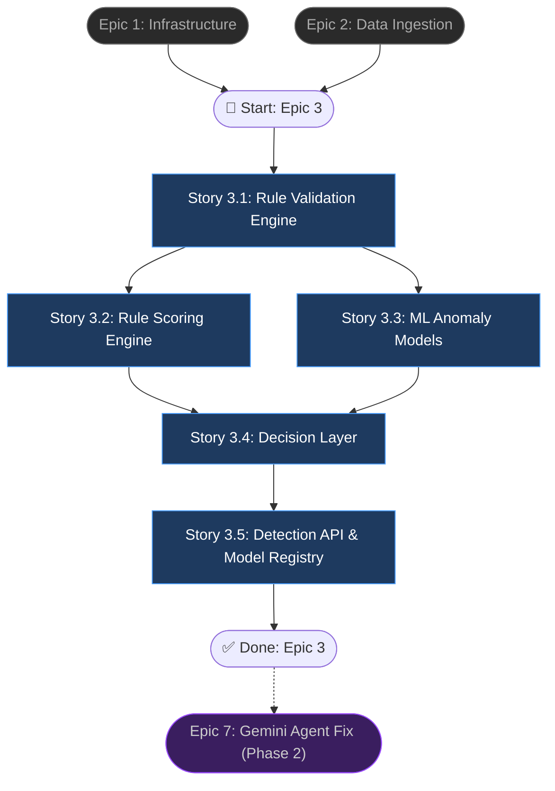

# Epic 3: AI Anomaly Detection Engine

## Epic Objective

Xây dựng hệ thống phát hiện dị thường 3 lớp: **Rule Validation (deterministic)** → **Rule Scoring (semi-soft)** → **ML Anomaly Detection (learned patterns)**. Business rules là gate chính (PRIMARY), ML anomaly detect những gì rules không cover (SECONDARY). Decision Layer kết hợp tất cả tín hiệu để đưa ra quyết định cuối cùng: reject / flag_for_review / accept. Đây là core detection engine — trái tim của platform. Agent fix pipeline (Gemini) được triển khai ở Epic 7 (Phase 2).

## Architecture Overview

```
        CSV INPUT (from Epic 2)
             ↓
    ┌─── Layer 1: Rule Validation ───┐
    │  Hard fail checks (deterministic) │
    │  missing, datatype, business logic │
    │  Source: business_rules.yaml       │
    └──────────┬────────────────────────┘
               ↓
    ┌─── Layer 2: Rule Scoring ──────┐
    │  Soft rules (semi-soft)           │
    │  warnings, suspicious values      │
    │  rule_score: 0.0 - 1.0           │
    │  Source: default.yaml domain_rules│
    └──────────┬────────────────────────┘
               ↓
    ┌─── Layer 3: ML Anomaly Models ──┐
    │  XGBoost CLEAN (supervised)       │
    │  DAE + Mahalanobis (unsupervised) │
    │  Attn-BiLSTM AE (unsupervised)    │
    │  BiLSTM Classifier (semi-sup)     │
    │  Ensemble stacking (all models)   │
    └──────────┬────────────────────────┘
               ↓
    ┌─── Decision Layer ─────────────┐
    │  hard_fail → reject              │
    │  soft_high OR anomaly_high       │
    │    → flag_for_review             │
    │  else → accept                   │
    └──────────┬────────────────────────┘
               ↓
        DETECTION RESULTS
    (→ Epic 7: Gemini Agent Fix, Phase 2)
```

## Flowchart


```mermaid
flowchart TD
    P1(["Epic 1: Infrastructure"]):::prev --> A
    P2(["Epic 2: Data Ingestion"]):::prev --> A
    A(["🚀 Start: Epic 3"]) --> B["Story 3.1: Rule Validation Engine"]
    B --> C["Story 3.2: Rule Scoring Engine"]
    B --> D["Story 3.3: ML Anomaly Models"]
    C --> E["Story 3.4: Decision Layer"]
    D --> E
    E --> F["Story 3.5: Detection API & Model Registry"]
    F --> G(["✅ Done: Epic 3"])
    G -.-> H(["Epic 7: Gemini Agent Fix (Phase 2)"]):::phase2

    B:::story
    C:::story
    D:::story
    E:::story
    F:::story
    classDef story fill:#1e3a5f,stroke:#4a9eff,color:#fff
    classDef prev fill:#2a2a2a,stroke:#666,color:#aaa
    classDef phase2 fill:#3a1e5f,stroke:#9a4aff,color:#ccc
```

## Stories

### Story 3.1: Rule Validation Engine (Layer 1 — Hard Rules)

As a data analyst,
I want the system to validate each CSV row against deterministic business rules,
so that obvious data errors are caught immediately before any ML processing.

#### Acceptance Criteria
1. `{ai_services_detection}/src/rules/rule_engine.py` implement `RuleValidationEngine` class
2. Rules loaded từ 2 config files đã có trong `{ai_services_detection}/configs/`:
   - `business_rules.yaml` — 13 rule sections (source of truth cho hard validation)
   - `column_mapping.yaml` — canonical column names + variant mapping (schema standardization)
3. Hard fail checks (severity `ERROR`) dựa trên `business_rules.yaml`:
   - **Field Type Enforcement** (Section 1): `force_string` fields (file_number, transaction_no, postal_code...) không bị parse thành numeric; `force_numeric` fields (transaction_price, gross_commission...) phải strip currency patterns (`S$`, `,`) rồi convert; `date_columns` phải parseable datetime
   - **Required Fields by Transaction Type** (Section 2): `project_transaction` cần file_number, transaction_price, commission...; `normal_transaction` cần submission_date, property_type, address...; `prosage_non_project` cần representing, property_address
   - **Constraints** (Section 3): `file_number` must be not_null + unique
   - **Price/Status Rules** (Section 4): active transactions (status NOT Aborted/Draft) → `transaction_price`, `gross_commission`, `billing_total` must be > 0
   - **Commission Formula** (Section 5): `closing_agent + icb + ecb = gross_commission` (tolerance $1); commission/price ratio ≤ 10%
   - **Agent/Salesperson Validation** (Section 9): `reg_no` format `^R\d{4,6}[A-Z]$`; validate against SNRE Agent List; ECB/Referral must NOT be internal agent (leakage detection)
   - **Address Validation** (Section 10): postal code required (Singapore `\d{6}` pattern); column shift detection (address values in property_type column); valid property types enforcement
   - **Representing Values** (Section 13): must be one of `["Landlord", "Tenant", "Seller", "Buyer"]`
   - **Cross-field Relationships** (Section 13): billing_name required if billing_address exists; referral_commission required if referral_name exists; icb_commission required if icb_name exists
4. Warning-level checks (severity `WARNING`) dựa trên `business_rules.yaml`:
   - **Entity Completeness** (Section 6): landlord/tenant name exists → at least 1 related field (NRIC, email, phone, UEN) must be filled
   - **Company Classification** (Section 7): name looks like company (PTE LTD suffix) but missing UEN → warning
   - **Company Dedup** (Section 8): normalized company names checked for duplicates across landlord/tenant/billing/ecb columns
   - **Entity Resolution** (Section 11): fuzzy name matching (threshold 0.85) across landlord/tenant identifiers; conflicting data → flag for human review
   - **JSON Array Validation** (Section 12): Prosage internal/external cobrokers JSON columns — key consistency across related columns
5. Column mapping: sử dụng `column_mapping.yaml` để normalize tất cả column variants về canonical names trước khi validate (e.g., `"Commssion+Tax"` typo → `commission_plus_tax`)
6. Output per row: `{"row_id": int, "errors": [{"field": "price", "error_type": "missing_value", "rule_section": "required_fields", "severity": "ERROR", "message": "..."}], "has_hard_fail": bool}`
7. `validate(dataframe) -> ValidationResult` xử lý toàn bộ dataset, trả về list of row errors
8. Performance: validate 100K rows < 10 giây
9. Config-driven: thêm rule mới chỉ cần edit YAML sections, không cần đổi code
10. Error output phải đủ chi tiết (field, error_type, rule_section, severity) để Epic 7 Gemini Agent có thể hiểu context và suggest fix chính xác

### Story 3.2: Rule Scoring Engine (Layer 2 — Soft Rules)

As a data analyst,
I want each row to receive a risk score based on soft rules,
so that suspicious but not invalid rows are flagged for further ML analysis.

#### Acceptance Criteria
1. `{ai_services_detection}/src/rules/rule_scorer.py` implement `RuleScoringEngine` class
2. Scoring rules loaded từ `{ai_services_detection}/configs/default.yaml` section `labels.domain_rules` — mỗi rule có `score` weight đã calibrate:
   - **HIGH_COMMISSION_RATIO** (score: 0.7): `gross_commission / transaction_price > 1.50` (150%) — catches data entry errors, not normal rental commissions
   - **FAST_COMPLETION** (score: 0.7): `completion_date - contract_date < 7 days` — suspicious speed
   - **PRICE_AREA_DEVIATION** (score: 0.5): price deviates > 300% from group median (grouped by `transaction_type`), min group size 30
   - **AGENT_VELOCITY** (score: 0.5): > 7 transactions/day/agent — SNRE has batch submissions
   - **BILLING_EXCEEDS_COMM** (score: 0.5): `billing_total / gross_commission > 1.15` (15% tolerance covers GST)
   - **NEGATIVE_VALUE** (score: 0.8): negative values in `transaction_price`, `gross_commission`, `billing_total`
   - **EXTREME_LEASE_DURATION** (score: 0.4): lease < 30 days or > 3650 days (10 years)
3. Additional scoring từ `labels.anomaly_sources` section:
   - `HIGH_RISK` flag từ `transaction-asian.xlsx` column
   - `PRICE_OUTLIER`: z-score > 5.0 on transaction_price
   - `SUSPICIOUS_DRAFT`: draft status + age > 730 days (2 years)
   - `BILLING_MISMATCH`: status = "Partially Invoiced"
   - `DUPLICATE_INVOICE`: matched from bills duplicate check report
4. Output per row: `{"row_id": int, "rule_score": 0.0-1.0, "triggered_rules": [{"rule": "HIGH_COMMISSION_RATIO", "score": 0.7, "detail": "ratio=2.3"}]}`
5. `rule_score` = weighted sum of triggered rule scores, normalized về [0, 1] — 0 = bình thường, 1 = rất suspicious
6. Rule scores có thể được chuyển thành features cho ML Layer 3 (rule-to-feature bridge)
7. Scoring weights per rule type configurable trong `default.yaml` (mỗi rule có field `score`)

### Story 3.3: ML Anomaly Detection Models (Layer 3)

As a data analyst,
I want ML models to detect anomalies that deterministic rules cannot cover,
so that subtle and complex patterns (regional outliers, rare feature combinations) are caught.

#### Acceptance Criteria
1. `{ai_services_detection}/src/models/` implement 5 model classes kế thừa `BaseAnomalyModel`:
   - `xgboost_detector.py` — XGBoost CLEAN (primary supervised model, V9 F1=0.88, 48 features without proxy)
   - `dae_detector.py` — DAE + Mahalanobis scoring (unsupervised baseline, latent_dim=16)
   - `attention_bilstm_ae.py` — **Attention-BiLSTM Autoencoder** (unsupervised, tabular feature sequence)
   - `bilstm_classifier.py` — **BiLSTM Classifier** (semi-supervised, DAE latent + raw features)
   - `ensemble_detector.py` — Ensemble stacking (all models, auto-exclude harmful components)
2. **Attention-BiLSTM Autoencoder** (NEW — unsupervised):
   - Input: tabular features treated as **feature sequence** `[batch, n_features, 1]` — mỗi feature là 1 timestep, KHÔNG phải time-series window aggregation (khác V9 A5 đã fail F1=0.498)
   - Architecture: BiLSTM encoder (bidirectional, hidden=64, 2 layers) → Multi-head Self-Attention (4 heads) → LSTM decoder → reconstruct features
   - Features sorted theo semantic groups trước khi feed vào model: Financial → Business Rule → Frequency → Temporal (giữ feature ordering có ý nghĩa)
   - Anomaly score = reconstruction error (MSE per row)
   - Train trên **normal-only data** (same as DAE training strategy)
   - Attention weights exportable → contributing features (which features were hardest to reconstruct)
3. **BiLSTM Classifier** (NEW — semi-supervised):
   - Input: concatenate DAE latent representation (16-dim) + raw tabular features (48-dim) = 64-dim, reshape thành sequence `[batch, 64, 1]`
   - Architecture: BiLSTM encoder (bidirectional, hidden=64, 2 layers) → Attention pooling → FC layers `[128, 64, 1]` → sigmoid
   - Train với labels từ `is_anomaly` column + `biz_rule_violation_count` (semi-supervised: combine rule-based labels + model pseudo-labels)
   - Class weighting: `W_ANOMALY=17.972`, `W_NORMAL=0.514` (from `default.yaml`)
   - Output: anomaly probability [0, 1] per row
   - Advantage over MLP (A8_SupervisedHead): BiLSTM captures sequential dependencies between latent features
4. `load_model(weights_path)` load pretrained weights từ `.pt` files
5. `predict(data: np.ndarray) -> AnomalyScores` trả về anomaly scores per row
6. XGBoost: feature importance per prediction (contributing_features)
7. Attention-BiLSTM AE: attention weights per prediction (contributing_features from reconstruction difficulty)
8. Ensemble: combine all model scores — auto-exclude models with negative weights (V9 strategy), nested val split for threshold tuning
9. `BaseAnomalyModel` interface: `load_model()`, `predict()`, `get_threshold()`, `get_feature_importance()`
10. Model inference trên CPU (GPU optional), target < 30s cho 100K rows
11. Rule scores từ Layer 2 có thể được thêm vào feature set cho ML models
12. Fine-tuning support: `train(dataframe, labels?) -> ModelWeights` cho cả 4 models — cho phép retrain trên dataset mới

### Story 3.4: Decision Layer & Deduplication

As a system administrator,
I want a unified decision layer that combines rule and ML results,
so that each row gets a single, consistent verdict (reject / flag / accept).

#### Acceptance Criteria
1. `{ai_services_detection}/src/decision/decision_engine.py` implement `DecisionEngine` class
2. Decision logic (configurable thresholds):
   - `hard_fail` (from Layer 1) → **reject**
   - `rule_score >= 0.7 OR anomaly_score >= threshold` → **flag_for_review**
   - Else → **accept**
3. Deduplication: nếu rule VÀ ML cùng flag 1 row, giữ rule reason là primary, ML reason là supporting evidence
4. Output per row:
   ```json
   {
     "row_id": 1,
     "decision": "reject|flag|accept",
     "rule_errors": [{"field": "price", "error_type": "missing_value"}],
     "rule_score": 0.85,
     "anomaly_score": 0.92,
     "reasons": ["missing_price", "outlier_commission"],
     "needs_fix": true
   }
   ```
5. Decision thresholds configurable qua config file (không hardcode)
6. Feedback loop interface: `export_anomaly_patterns()` để đề xuất new rules từ ML findings
7. Summary statistics: total_rejected, total_flagged, total_accepted, anomaly_ratio
8. `get_fixable_rows()` trả về tất cả rows cần fix (reject + flagged) kèm error context — đây là input cho Epic 7 Gemini Agent (Phase 2)

### Story 3.5: Detection API & Model Registry

As a user,
I want an API endpoint to run the full 3-layer detection pipeline on my uploaded dataset,
so that I get detection results without manual configuration.

#### Acceptance Criteria
1. `POST /api/v1/analysis/detect` body: `{"dataset_id": str, "config_override?": object}`
   - Pipeline: load data (Epic 2) → Layer 1 → Layer 2 → Layer 3 → Decision → save results
2. `GET /api/v1/analysis/{id}/results` trả về per-row details:
   ```json
   [
     {
       "row_idx": 0,
       "decision": "flag",
       "anomaly_score": 0.87,
       "rule_score": 0.3,
       "rule_errors": [],
       "contributing_features": ["commission_ratio", "price_outlier"]
     }
   ]
   ```
3. Model Registry (`{ai_services_detection}/src/models/model_registry.py`):
   - Quản lý model versions, weights paths, metadata
   - `register_model(name, version, weights_path)`
   - `get_model(name, version?)` — auto load latest nếu không specify version
4. Kết quả lưu vào bảng `analysis_results`: model_used, total_anomalies, total_rejected, total_flagged, anomaly_ratio, scores_json, metrics, duration_seconds
5. Metrics calculated: precision, recall, f1_score, auc_roc (nếu có ground truth labels)
6. Celery async task cho pipeline execution (non-blocking API)
7. `GET /api/v1/analysis/{id}/status` trả về pipeline progress:
   ```json
   {
     "status": "running",
     "current_step": "ml_detection",
     "steps": ["rule_validation", "rule_scoring", "ml_detection", "decision"],
     "progress_pct": 75
   }
   ```

## Dependencies
- **Epic 1**: Infrastructure, Database schema (`analysis_results` table), Docker, Redis
- **Epic 2**: DataService (uploaded & preprocessed data từ MinIO)
- **Pretrained V9 weights**: `a2_dae_v9.pt`, `a8_semisup_v9.pt`, XGBoost model — lưu trong `{ai_services_detection}/models/v9/`
- **Config files**: `{ai_services_detection}/configs/business_rules.yaml`, `column_mapping.yaml`, `default.yaml`
- PyTorch 2.x + XGBoost trong Docker image
- Redis + Celery cho async pipeline

## Additional Notes
- **Rule engine là config-driven**: thêm rule mới chỉ cần edit YAML, không cần deploy lại code
- **Existing configs** (`business_rules.yaml` — 13 sections, `column_mapping.yaml` — 90+ canonical columns, `default.yaml` — scoring rules + pipeline config) là foundation cho Stories 3.1 và 3.2
- **Model lineup (5 models)**:
  - **XGBoost CLEAN** (V9 F1=0.88): best supervised performer, no proxy leakage, 48 features — primary model
  - **DAE + Mahalanobis** (unsupervised): latent_dim=16, MSE + Mahalanobis scoring — unsupervised baseline
  - **Attention-BiLSTM Autoencoder** (NEW, unsupervised): treat tabular features as sequence → BiLSTM + Multi-head Attention → reconstruct. Khác hoàn toàn V9 A5 (time-series windows, F1=0.498) — lần này chạy trên **raw tabular features**, không qua weekly aggregation/PCA
  - **BiLSTM Classifier** (NEW, semi-supervised): DAE latent (16-dim) + raw features (48-dim) → BiLSTM + Attention pooling → binary classification. Thay thế A8_SupervisedHead (MLP) bằng BiLSTM — capture sequential dependencies giữa latent features
  - **Ensemble stacking**: combine all 4 model scores, auto-exclude harmful components (negative LR weights), nested val split cho threshold tuning
- **Không dùng TranAD/AnoGAN** — V9 results: TranAD F1=0.491 (AUC=0.50, random), AnoGAN chưa test
- **BiLSTM V9 vs NEW approach**: V9 BiLSTM fail vì chạy trên time-series windows (weekly aggregation → PCA → sliding windows size=8, val có 0 anomalies). NEW approach: chạy trực tiếp trên tabular features, mỗi feature = 1 timestep, train trên full dataset với proper stratified split
- **Feature ordering cho BiLSTM**: features sorted theo semantic groups (Financial → Business Rule → Frequency → Temporal) để BiLSTM capture intra-group dependencies
- **Deduplication quan trọng**: tránh double-counting khi rule và ML cùng detect 1 lỗi
- Stories 3.1 và 3.3 có thể phát triển song song (Layer 1 rules + Layer 3 ML independent)
- Story 3.2 phụ thuộc 3.1 (cùng rule framework), Story 3.4 phụ thuộc cả 3.1, 3.2, 3.3
- **Phase 2 extension**: Epic 7 (Gemini Agent Auto-Fix) sẽ consume output từ `get_fixable_rows()` của Story 3.4, adding fix → re-validate → final data pipeline
