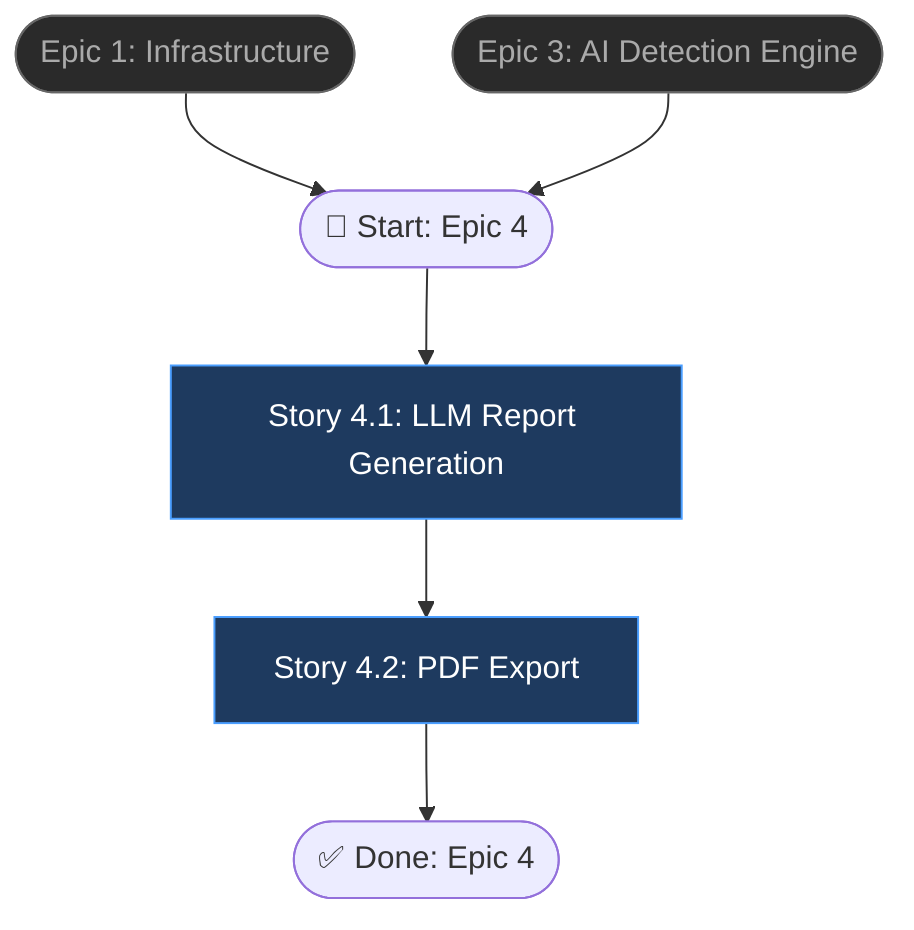

# Epic 4: NLP Report Generation

## Epic Objective

Sử dụng LLM (OpenAI API hoặc Local Llama) với kỹ thuật Chain-of-Thought để sinh báo cáo phân tích dị thường bằng ngôn ngữ tự nhiên. Hỗ trợ song ngữ Việt/Anh, hai format (summary/detailed), và xuất PDF chuyên nghiệp. Epic này biến kết quả số liệu khô khan từ AI engine thành insights dễ hiểu cho người dùng không chuyên kỹ thuật.

## Flowchart

## Stories

### Story 4.1: LLM Report Generation

As a user,
I want the system to generate a natural language report explaining the anomalies found,
so that I can understand the results without deep technical knowledge.

#### Acceptance Criteria
1. `NLPService.generate_report(anomaly_result, language, style)` tạo báo cáo Markdown
2. Hỗ trợ `language`: `vi` (tiếng Việt) và `en` (English)
3. Hỗ trợ `style`: `summary` (1-2 trang tóm tắt) và `detailed` (5-10 trang chi tiết)
4. Chain-of-Thought prompting: LLM phân tích step-by-step trước khi đưa ra kết luận
5. Report structure:
   - Executive Summary: tổng quan kết quả
   - Anomaly Details: top-N dị thường quan trọng nhất với giải thích
   - Statistical Overview: phân bố scores, anomaly ratio
   - Recommendations: đề xuất hành động
6. `POST /api/v1/report/generate` body: `{analysis_id, language?, style?}`
7. Report content lưu vào bảng `reports` (field `content` — Markdown text)
8. LLM provider configurable: OpenAI API (default) hoặc Local Llama endpoint
9. Fallback: nếu LLM API fail, generate template-based report (không dùng AI)

### Story 4.2: PDF Export

As a user,
I want to download the analysis report as a PDF,
so that I can share it with stakeholders.

#### Acceptance Criteria
1. `NLPService.export_pdf(report_id)` chuyển Markdown content sang PDF
2. PDF engine: ReportLab hoặc WeasyPrint (support Unicode tiếng Việt)
3. PDF layout: header (logo + title), footer (page numbers), margins, professional typography
4. Bao gồm charts/tables nếu có trong report (render từ data)
5. PDF lưu vào MinIO bucket `reports`: `{user_id}/{report_id}/report.pdf`
6. `pdf_path` cập nhật trong bảng `reports`
7. `GET /api/v1/report/{id}/download` stream PDF về client với header `Content-Disposition: attachment`
8. Trả `404` nếu report chưa có PDF, `403` nếu không phải owner

## Dependencies
- **Epic 1**: Infrastructure, Auth, MinIO
- **Epic 3**: AnomalyResult (input cho report generation)
- OpenAI API key hoặc Local Llama endpoint URL configured
- Font hỗ trợ tiếng Việt cho PDF rendering

## Additional Notes
- LLM context window: cần truncate anomaly details nếu quá dài (> 4K tokens)
- Cost consideration: mỗi report call tốn ~$0.01-0.05 nếu dùng OpenAI
- Rate limiting cho report generation: max 10 reports/user/hour
- PDF caching: không re-generate nếu report content chưa thay đổi
