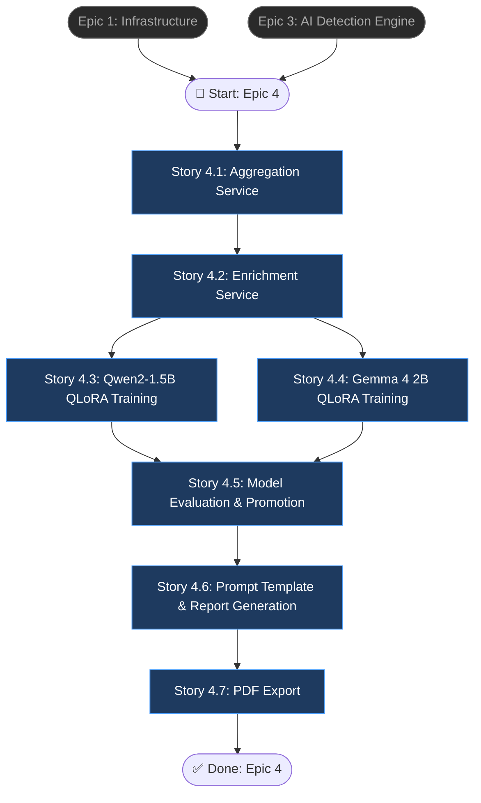

# Epic 4: NLP Report Generation

## Epic Objective

Xây dựng pipeline sinh báo cáo production-level với 4 bước: **Aggregation → Enrichment → Prompt Builder → LLM**. Fine-tune **Qwen2-1.5B với QLoRA** (primary) và **Gemma 4 2B** (backup) trên domain data (structured JSON → báo cáo Markdown). Toàn bộ R&D, training, evaluation thực hiện tại `{ai_services_generation}/` với versioned notebooks. Chỉ khi model đạt target metrics mới promote sang `{backend}/` cho production serving. LLM chỉ đóng vai trò "viết văn" — mọi tính toán số học được thực hiện trước bởi Aggregator + Enrichment Layer. Hỗ trợ song ngữ Việt/Anh, xuất PDF chuyên nghiệp. Template-based fallback khi LLM fail.

## Project Structure

```
csv_agent_platform/generation/          ← R&D & Training (AI Platform)
├── notebooks/
│   ├── train_generation_v1.ipynb       ← Data prep + baseline experiments
│   ├── train_generation_v2.ipynb       ← Qwen2-1.5B QLoRA fine-tune
│   ├── train_generation_v3.ipynb       ← Gemma 4 2B QLoRA fine-tune
│   ├── train_generation_v4.ipynb       ← Model comparison & evaluation
│   └── ...                             ← Versioned iterations
├── src/
│   ├── aggregation/
│   │   └── aggregation_service.py      ← Story 4.1
│   ├── enrichment/
│   │   └── enrichment_service.py       ← Story 4.2
│   ├── training/
│   │   ├── train_qwen_lora.py          ← Story 4.3
│   │   ├── train_gemma_lora.py         ← Story 4.4
│   │   ├── data_loader.py              ← Shared JSONL loader
│   │   └── evaluate.py                 ← BLEU/ROUGE evaluation
│   ├── inference/
│   │   ├── model_router.py             ← Primary → Backup → Fallback
│   │   └── report_generator.py         ← NLPService core
│   └── templates/
│       ├── report_prompt.j2            ← LLM prompt template
│       └── fallback_report.j2          ← Template-based fallback
├── configs/
│   └── generation_config.yaml          ← Model configs, thresholds
├── models/
│   ├── qwen2-1.5b-lora-adapter/       ← Qwen2 adapter weights
│   ├── gemma4-2b-lora-adapter/         ← Gemma 4 adapter weights
│   └── model_comparison.md             ← Evaluation results log
├── data/
│   ├── report-sample/                  ← Sample reports (existing)
│   └── training/                       ← JSONL training data
├── outputs/                            ← Notebook outputs, eval results
├── tests/
│   ├── test_aggregation.py
│   ├── test_enrichment.py
│   └── test_generation.py
├── requirements.txt
└── setup.py

csv_agent_services/backend/             ← Production Serving (chỉ sau khi đạt target)
├── app/
│   ├── services/
│   │   └── nlp_service.py              ← Production NLPService (promoted từ generation/)
│   ├── api/
│   │   └── report.py                   ← POST /api/v1/report/generate, GET /download
│   └── ml/
│       └── generation/
│           ├── model_router.py         ← Production model router
│           ├── adapter_weights/        ← Promoted adapter weights (best version)
│           └── templates/              ← Promoted Jinja2 templates
```

**Promotion flow**: `{ai_services_generation}/` (R&D, iterate) → đạt target → copy best adapter weights + inference code → `{backend}/app/ml/generation/` (production)

## Model Selection

### Primary: Qwen2-1.5B + QLoRA

| Attribute | Value |
|---|---|
| Parameters | 1.5B |
| Architecture | Decoder-only (Qwen2 family) |
| VRAM Fine-tune (QLoRA 4-bit) | ~4GB |
| VRAM Inference (int4) | ~1.5GB |
| Vietnamese Support | Tốt — multilingual tokenizer tối ưu cho CJK + Vietnamese |
| Lý do chọn | Nhẹ nhất dòng Qwen, Vietnamese tốt nhất trong nhóm model nhỏ, fine-tune nhanh trên Colab T4 free, inference chạy được trên CPU |

### Backup: Gemma 4 2B

| Attribute | Value |
|---|---|
| Parameters | 2B |
| VRAM Fine-tune (QLoRA 4-bit) | ~5GB |
| VRAM Inference (int4) | ~2GB |
| Vietnamese Support | Trung bình — multilingual nhưng cần thêm Vietnamese data |
| Lý do chọn backup | Google backing, instruction-following tốt, kiến trúc mới, dùng khi Qwen2-1.5B underperform trên specific tasks |

### Fallback: Template-based (No AI)

Khi cả 2 LLM fail (timeout, OOM, service unavailable), hệ thống generate báo cáo từ Jinja2 templates với dữ liệu đã enriched — không cần GPU, đảm bảo user luôn nhận được report.

## Flowchart


```mermaid
flowchart TD
    P1(["Epic 1: Infrastructure"]):::prev --> A
    P3(["Epic 3: AI Detection Engine"]):::prev --> A
    A(["🚀 Start: Epic 4"]) --> B["Story 4.1: Aggregation Service"]
    B --> C["Story 4.2: Enrichment Service"]
    C --> D["Story 4.3: Qwen2-1.5B QLoRA Training"]
    C --> E["Story 4.4: Gemma 4 2B QLoRA Training"]
    D --> F["Story 4.5: Model Evaluation & Promotion"]
    E --> F
    F --> G["Story 4.6: Prompt Template & Report Generation"]
    G --> H["Story 4.7: PDF Export"]
    H --> I(["✅ Done: Epic 4"])

    B:::story
    C:::story
    D:::story
    E:::story
    F:::story
    G:::story
    H:::story
    classDef story fill:#1e3a5f,stroke:#4a9eff,color:#fff
    classDef prev fill:#2a2a2a,stroke:#666,color:#aaa
```

## Pipeline Architecture

```
Raw anomalies (Từ AI Models — Epic 3 Detection Engine)
       ↓
Aggregator (Gom nhóm, đếm count, tìm missing)
       ↓
Enrichment Layer (Tính ratio, score, rank priority, cross-analysis)
       ↓
Prompt Builder (Jinja2 Template + Instructions)
       ↓
┌─────────────────────────────────────────┐
│  Model Router                           │
│  ├─ Primary:  Qwen2-1.5B + QLoRA       │
│  ├─ Backup:   Gemma 4 2B + QLoRA       │
│  └─ Fallback: Template-based (no AI)   │
└─────────────────────────────────────────┘
       ↓
Markdown Report (Việt / Anh)
       ↓
PDF Export (ReportLab / WeasyPrint)
```

**Nguyên tắc cốt lõi:** `Aggregator + Enrichment quality = 80% output quality`. LLM chỉ rewrite dữ liệu đã chuẩn bị, **tuyệt đối không để LLM tự làm toán** (ngăn hallucination).

## Hardware Requirements

| Task | Minimum | Recommended |
|---|---|---|
| Fine-tune (QLoRA 4-bit) | GPU ≥8GB VRAM (RTX 3060, Colab T4) | GPU ≥12GB (RTX 3080, Colab T4) |
| Inference (int4 quantization) | GPU ≥4GB hoặc CPU (llama.cpp / GGUF) | GPU ≥6GB |
| Model size (Qwen2-1.5B) | ~3GB FP16 → ~1GB int4 | — |
| Model size (Gemma 4 2B) | ~4GB FP16 → ~1.5GB int4 | — |

## Stories

### Story 4.1: Aggregation Service

As a developer,
I want raw anomaly results grouped into semantic clusters with counts and summaries,
so that the LLM receives structured, pre-computed data instead of raw JSON.

#### Acceptance Criteria
1: `{ai_services_generation}/src/aggregation/aggregation_service.py` implement `AggregationService` class
2: `AggregationService.aggregate(detection_result)` nhóm anomalies thành clusters theo `issue_type` (MISSING_TRANSACTION, HIGH_COMMISSION, DUPLICATE_ENTRY, ...)
3: Mỗi cluster chứa: `issue_type`, `count`, `samples[]` (top 3-5 mẫu đại diện), `affected_ids[]`
4: Context summary được tính toán sẵn: `total_records`, `expected`, `missing`, `anomaly_ratio`
5: Cross-analysis equations được sinh trước (VD: `-48 issued + 366 paid = 318 net difference`) — LLM chỉ cần rewrite, không tự tính
6: Output là structured JSON chuẩn, sẵn sàng cho Enrichment Layer
7: Unit tests tại `{ai_services_generation}/tests/test_aggregation.py`

### Story 4.2: Enrichment Service

As a developer,
I want aggregated anomaly clusters enriched with numerical reasoning signals, priority ranking, and semantic text,
so that the LLM can generate accurate reports without performing any calculations.

#### Acceptance Criteria
1: `{ai_services_generation}/src/enrichment/enrichment_service.py` implement `EnrichmentService` class
2: `EnrichmentService.enrich(aggregated_data)` thêm cho mỗi cluster: `ratio` (VD: "1.34% of total"), `priority` (1-3), `impact_score` (0-1), `impact` level (High/Medium/Low)
3: Priority ranking dựa trên `impact_score`: score ≥0.8 → priority 1, ≥0.5 → priority 2, còn lại → priority 3
4: Sinh `semantic_text` cho detailed reports: "Price is 45% higher than district average", "Commission is 80% higher than expected"
5: Individual anomaly detail chứa: `risk_level`, `anomaly_score`, `key_findings[]`, `location_context`, `temporal_context`
6: Output JSON đạt chuẩn "Semantic & Enriched" — LLM có thể viết report chỉ bằng cách rewrite
7: Unit tests tại `{ai_services_generation}/tests/test_enrichment.py`

### Story 4.3: Qwen2-1.5B QLoRA Fine-Tuning (Primary Model)

As an ML engineer,
I want to fine-tune Qwen2-1.5B with QLoRA on structured anomaly data → report pairs,
so that the model generates accurate, professionally-toned reports in Vietnamese and English.

#### Acceptance Criteria
1: Training notebook `{ai_services_generation}/notebooks/train_generation_v1.ipynb` — data preparation, baseline prompt experiments (zero-shot, few-shot trên base Qwen2-1.5B)
2: Training notebook `{ai_services_generation}/notebooks/train_generation_v2.ipynb` — Qwen2-1.5B QLoRA fine-tune, hyperparameter search
3: Training script `{ai_services_generation}/src/training/train_qwen_lora.py` — standalone script extracted từ notebook (cho CI/CD và reproducibility)
4: Shared data loader `{ai_services_generation}/src/training/data_loader.py` — load JSONL dataset, train/val/test split
5: Dataset format: JSONL tại `{ai_services_generation}/data/training/` với `Instruction + Input (Enriched JSON) + Output (Markdown Report)` — **KHÔNG train từ raw JSON**
6: Instruction template bao gồm: tone (professional audit), structure (Executive Summary → Key Issues → Cross Analysis → Recommendations), format rules (bullet points, bold, numeric references)
7: LoRA config: `r=32`, `alpha=64`, target modules `q_proj`, `v_proj`, `k_proj`, `o_proj` — tăng r để compensate cho model nhỏ (1.5B)
8: Fine-tuning chạy được trên Colab T4 (4-bit QLoRA, ~4GB VRAM) và local GPU ≥8GB
9: Training data: **≥5,000-10,000 samples** dạng `Instruction + Enriched Input + Expected Markdown` (Qwen2-1.5B converge nhanh)
10: Adapter weights lưu vào `{ai_services_generation}/models/qwen2-1.5b-lora-adapter/`
11: Training logs + metrics lưu vào `{ai_services_generation}/outputs/`
12: Mỗi experiment iteration tạo notebook version mới (v2.1, v2.2, ...) — giống pattern detection (v7→v8→v9→v10→v11)

### Story 4.4: Gemma 4 2B QLoRA Fine-Tuning (Backup Model)

As an ML engineer,
I want to fine-tune Gemma 4 2B as a backup model,
so that the system has an alternative when Qwen2-1.5B underperforms on specific report types.

#### Acceptance Criteria
1: Training notebook `{ai_services_generation}/notebooks/train_generation_v3.ipynb` — Gemma 4 2B QLoRA fine-tune
2: Training script `{ai_services_generation}/src/training/train_gemma_lora.py` — reuse data_loader.py và evaluate.py từ Story 4.3
3: Cùng dataset JSONL với Story 4.3 — đảm bảo consistent comparison
4: LoRA config: `r=32`, `alpha=64`, target modules theo Gemma architecture (`q_proj`, `v_proj`, `k_proj`, `o_proj`)
5: Fine-tuning trên Colab T4 (QLoRA 4-bit, ~5GB VRAM) hoặc local GPU ≥8GB
6: Adapter weights lưu vào `{ai_services_generation}/models/gemma4-2b-lora-adapter/`

### Story 4.5: Model Evaluation & Promotion to Production

As an ML engineer,
I want to evaluate all trained models on the same test set and promote the best to production,
so that only models meeting quality targets are deployed.

#### Acceptance Criteria
1: Evaluation notebook `{ai_services_generation}/notebooks/train_generation_v4.ipynb` — head-to-head comparison
2: Evaluation script `{ai_services_generation}/src/training/evaluate.py` implement:
   - BLEU score (corpus-level)
   - ROUGE-L (summary overlap)
   - BERTScore (semantic similarity, optional)
   - Human-eval rubric template (format compliance, factual accuracy, tone)
3: **Target metrics để promote**: ROUGE-L ≥ 0.45, BLEU ≥ 0.30, format compliance ≥ 90%
4: Kết quả comparison ghi vào `{ai_services_generation}/models/model_comparison.md` — bảng so sánh Qwen2 vs Gemma 4 trên tất cả metrics
5: Export GGUF format cho model đạt target (hỗ trợ CPU deployment với llama.cpp)
6: **Promotion process**: khi model đạt target →
   - Copy best adapter weights → `{backend}/app/ml/generation/adapter_weights/`
   - Copy inference code (model_router.py, report_generator.py) → `{backend}/app/ml/generation/`
   - Copy Jinja2 templates → `{backend}/app/ml/generation/templates/`
   - Update `{backend}/app/services/nlp_service.py` để import từ `app.ml.generation`
7: Model chưa đạt target → tiếp tục iterate tại `{ai_services_generation}/notebooks/` (tạo v5, v6, ...)

### Story 4.6: Prompt Template & Report Generation Service

As a user,
I want the system to generate a natural language report explaining the anomalies found,
so that I can understand the results without deep technical knowledge.

#### Acceptance Criteria
1: Prompt template `{ai_services_generation}/src/templates/report_prompt.j2` nhận Enriched JSON từ Story 4.2, render thành prompt chuẩn với `### Instruction` + `### Input` + `### Output`
2: Fallback template `{ai_services_generation}/src/templates/fallback_report.j2` — Jinja2 template sinh Markdown từ Enriched data (không cần LLM)
3: `{ai_services_generation}/src/inference/model_router.py` — **Model Router** logic: try Primary (Qwen2-1.5B) → nếu fail → try Backup (Gemma 4 2B) → nếu fail → Fallback (template-based)
4: `{ai_services_generation}/src/inference/report_generator.py` — `NLPService.generate_report()` gọi pipeline: Aggregate → Enrich → Render Template → Model Router
5: Hỗ trợ `language`: `vi` (Việt) và `en` (English) — via prompt language instruction
6: Hỗ trợ `style`: `summary` (tóm tắt ≤500 từ, cluster-level) và `detailed` (per-anomaly explanation với semantic text)
7: Force Tone: professional audit tone (consulting-style recommendations: "Investigate missing transactions" thay vì "Bạn nên...")
8: Template-based fallback generate Markdown report từ Jinja2 template + Enriched data (không cần GPU)
9: Inference timeout ≤30s cho Qwen2-1.5B, ≤45s cho Gemma 4 2B
10: **After promotion** (Story 4.5): production API tại `{backend}/`:
    - `POST /api/v1/report/generate` body: `{analysis_id, language?, style?, model?}`
    - Report content lưu vào bảng `reports` (field `content` — Markdown, `model_used` — track model nào đã dùng)
11: Unit tests tại `{ai_services_generation}/tests/test_generation.py`

### Story 4.7: PDF Export

As a user,
I want to download the analysis report as a PDF,
so that I can share it with stakeholders.

#### Acceptance Criteria
1: `NLPService.export_pdf(report_id)` chuyển Markdown content sang PDF (ReportLab/WeasyPrint)
2: PDF engine hỗ trợ Unicode tiếng Việt đầy đủ (font: Noto Sans Vietnamese)
3: PDF layout: header (logo + title), footer (page numbers), margins, professional typography
4: Bao gồm charts/tables nếu có trong report (render từ data)
5: PDF lưu vào MinIO bucket `reports`: `{user_id}/{report_id}/report.pdf`
6: `pdf_path` cập nhật trong bảng `reports`
7: `GET /api/v1/report/{id}/download` stream PDF về client với header `Content-Disposition: attachment`
8: Trả `404` nếu report chưa có PDF, `403` nếu không phải owner

## Notebook Versioning Strategy

Theo pattern từ Epic 3 detection (`train_detection_v7.py` → `v8` → `v9` → `v10` → `v11`):

| Version | Notebook | Purpose |
|---|---|---|
| v1 | `train_generation_v1.ipynb` | Data prep, EDA trên report-sample, baseline zero-shot/few-shot |
| v2 | `train_generation_v2.ipynb` | Qwen2-1.5B QLoRA fine-tune, hyperparameter search |
| v3 | `train_generation_v3.ipynb` | Gemma 4 2B QLoRA fine-tune |
| v4 | `train_generation_v4.ipynb` | Head-to-head evaluation, model comparison |
| v5+ | `train_generation_v5+.ipynb` | Iterations: data augmentation, prompt tuning, error analysis |

**Rule**: Mỗi notebook version KHÔNG overwrite version cũ — luôn tạo file mới để giữ lịch sử thí nghiệm.

**Existing notebooks** (đã có trong `{ai_services_generation}/notebooks/`):
- `ViT5_Training_Kaggle.ipynb` — early ViT5 experiment (reference)
- `finetune_small_llms_colab.ipynb` — small LLM fine-tune experiments (reference)
- `train_focused_models.ipynb` — focused model training (reference)

Các notebook mới sẽ follow naming convention `train_generation_vN.ipynb`.

## Dependencies
- **Epic 1**: Infrastructure, Database schema (`reports` table), Docker, MinIO
- **Epic 3**: Detection results (input cho Aggregation Service)
- **Existing data**: `{ai_services_generation}/data/report-sample/` — sample reports for training data generation
- Hugging Face access cho Qwen2-1.5B và Gemma 4 2B model weights
- Font hỗ trợ tiếng Việt cho PDF rendering (Noto Sans Vietnamese)
- Colab T4 hoặc local GPU ≥8GB cho fine-tuning

## Additional Notes
- **R&D tại `{ai_services_generation}/`, production tại `{backend}/`**: Giống Epic 3 detection — iterate nhanh trong AI platform, chỉ promote code ổn định sang backend
- **Model nhỏ = nhanh hơn, rẻ hơn**: Qwen2-1.5B inference ~5-10x nhanh hơn 7B, phù hợp cho production trên hardware giới hạn
- **CPU deployment khả thi**: Với GGUF + llama.cpp, Qwen2-1.5B chạy được trên CPU (latency ~10-20s/report)
- **Qwen2-1.5B converge nhanh**: 5K-10K samples đủ cho domain-specific fine-tuning (vs 50K cho 7B)
- **LoRA r=32 cho model nhỏ**: Tăng rank LoRA để compensate cho ít parameters gốc, giữ adapter size ~50-100MB
- LLM context window: Qwen2-1.5B hỗ trợ 32K tokens, đủ cho hầu hết reports
- Rate limiting cho report generation: max 10 reports/user/hour
- PDF caching: không re-generate nếu report content chưa thay đổi
- `model_used` field trong bảng `reports` giúp track model performance trong production
- **Notebook outputs**: Kết quả training (loss curves, eval metrics, sample outputs) lưu tại `{ai_services_generation}/outputs/` — không commit vào git (add to .gitignore)
