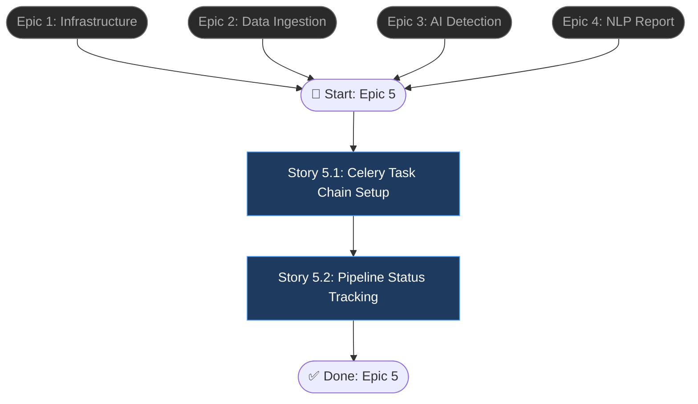

# Epic 5: Full Pipeline Orchestration

## Epic Objective

Kết nối toàn bộ luồng xử lý bất đồng bộ: preprocess → detect → fix → report → PDF, sử dụng Celery chain tasks với Redis broker. Epic này biến các services riêng lẻ (Data, AI, NLP) thành một pipeline tự động mà người dùng chỉ cần "nhấn 1 nút". Theo dõi trạng thái realtime qua API giúp người dùng biết pipeline đang ở bước nào.

## Flowchart



## Stories

### Story 5.1: Celery Task Chain Setup

As a developer,
I want the full pipeline orchestrated as a Celery chain,
so that long-running analysis runs asynchronously without blocking the API.

#### Acceptance Criteria
1. Celery app configured với Redis broker (`redis://redis:6379/0`)
2. 5 Celery tasks defined:
   - `preprocess_task(dataset_id)` → calls `DataService.preprocess()`
   - `detect_anomalies_task(dataset_id)` → calls `AIService.detect_anomalies()`
   - `fix_data_task(dataset_id, auto_fix)` → optional auto-correction
   - `generate_report_task(analysis_id, language, style)` → calls `NLPService.generate_report()`
   - `export_pdf_task(report_id)` → calls `NLPService.export_pdf()`
3. `PipelineService.run_full_pipeline(dataset_id, config)` tạo `chain()` và `apply_async()`
4. Trả về `pipeline_id` (UUID) cho status tracking
5. Mỗi task update `pipeline_runs.current_step` khi bắt đầu
6. Nếu bất kỳ task nào fail → pipeline status = `failed`, lưu `error_message`
7. Task retry: max 3 retries với exponential backoff cho transient errors
8. Config object: `{auto_fix: bool, language: str, report_style: str, model_override?: str}`

### Story 5.2: Pipeline Status Tracking

As a user,
I want to check the status of my running pipeline,
so that I know which step is executing and when it will complete.

#### Acceptance Criteria
1. `POST /api/v1/pipeline/run` body: `{dataset_id, config}` → bắt đầu pipeline, trả về `{pipeline_id, status: "pending"}`
2. `GET /api/v1/pipeline/{id}/status` trả về:
   ```json
   {
     "pipeline_id": "uuid",
     "status": "running",
     "current_step": "detect_anomalies",
     "steps": [
       {"name": "preprocess", "status": "completed", "duration_seconds": 12.5},
       {"name": "detect_anomalies", "status": "running", "started_at": "..."},
       {"name": "fix_data", "status": "pending"},
       {"name": "generate_report", "status": "pending"},
       {"name": "export_pdf", "status": "pending"}
     ],
     "started_at": "...",
     "completed_at": null,
     "result_id": null,
     "report_id": null
   }
   ```
3. Status transitions: `pending` → `running` → `completed` / `failed`
4. Khi completed: `result_id` và `report_id` populated trong response
5. Trả `404` nếu pipeline_id không tồn tại
6. Trả `403` nếu pipeline không thuộc current user
7. WebSocket endpoint `ws://host/ws/pipeline/{id}` push status updates realtime (optional)

## Dependencies
- **Epic 1**: Docker (Redis), Database
- **Epic 2**: DataService (preprocess task)
- **Epic 3**: AIService (detect task)
- **Epic 4**: NLPService (report + PDF tasks)
- Celery worker process phải chạy song song với FastAPI server

## Additional Notes
- Celery worker concurrency: 2-4 processes (configurable)
- Pipeline timeout: 10 minutes max, fail nếu vượt quá
- `fix_data_task` hiện tại là placeholder — sẽ implement chi tiết khi có requirements rõ hơn
- WebSocket là optional enhancement; polling `GET /status` là baseline
