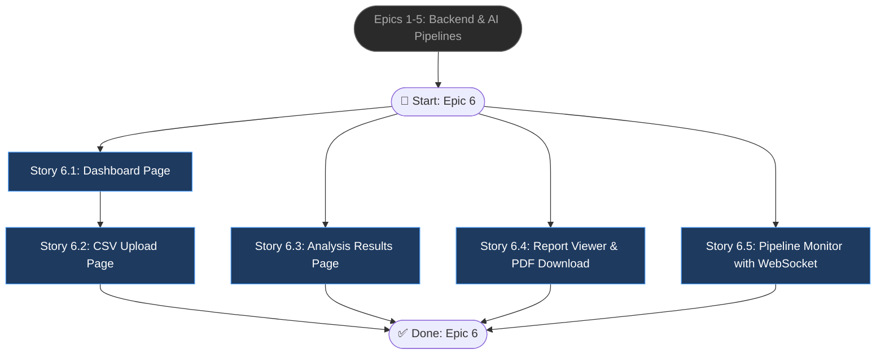

# Epic 6: Frontend Dashboard & UI

## Epic Objective

Xây dựng ứng dụng giao diện Next.js 14 với kiến trúc App Router, bao gồm 5 trang chính liên kết chặt chẽ với nhau: Dashboard tổng quan, Upload file CSV mới, Xem chi tiết kết quả Analysis, Xem/tải Report PDF, và Màn hình theo dõi Pipeline realtime. Hướng đến giao diện hiện đại, đáp ứng tốt cho người dùng cuối và cung cấp trải nghiệm phân tích data trực quan.

## Flowchart

## Stories

### Story 6.1: Dashboard Page
As a user,
I want a dashboard showing overview statistics and recent analyses,
so that I have a quick glance at my data activity.

#### Acceptance Criteria
1. Hiển thị metrics tổng quan: tổng số lượng datasets, tổng số report đã sinh, tỉ lệ phát hiện dị thường (anomaly detection rate).
2. Render danh sách bảng dữ liệu 5 analyses gần nhất cùng với `status` (Running, Completed, Failed).
3. Đồ thị Charts tổng quan vẽ bằng thư viện màn hình (Recharts hoặc D3.js).

### Story 6.2: CSV Upload Page
As a user,
I want to drag-and-drop CSV files and preview data before analysis,
so that I can verify the correct file is uploaded safely.

#### Acceptance Criteria
1. Xây dựng component UI `CSVUploader`: hỗ trợ drag-drop zone rõ ràng và hiển thị error validation (dung lượng/định dạng).
2. Xây dựng component `CSVPreview`: kết xuất hiển thị data table minh bạch lấy từ 10 mẫu dòng head API.
3. Component `DataTypeIndicator` trực quan hóa loại dữ liệu (tabular, timeseries, mixed) mà hệ thống API trả về.
4. Tích hợp `ModelSelector`: cho phép người dùng tùy chỉnh model manual (TranAD, BiLSTM...) hoặc phó thác cho Backend auto.

### Story 6.3: Analysis Results Page
As a user,
I want to see anomaly detection results with visual heatmaps and highlighted rows,
so that I can quickly identify problematic data rows.

#### Acceptance Criteria
1. Xây dựng biểu đồ nhiệt (Score Heatmap) kết cấu từ chuỗi điểm anomaly scores trả về bởi API (TranAD / BiLSTM / AnoGAN).
2. Phân trang Data Table (`AnomalyTable`), bôi sáng (highlighted) bằng cảnh báo màu đỏ trực tiếp các row/cột có nguy cơ dị thường.
3. Rendering `AnomalyChart`: bar chart hiển thị phân bố độ mật độ score dị thường.
4. Chức năng Filter, sắp xếp sort theo anomaly_score hoặc row_idx tiện lợi cho Data Analyst.

### Story 6.4: Report Viewer & PDF Download
As a user,
I want to view the generated NLP report and download it as PDF,
so that I can read and present analytical insights conveniently to stakeholders.

#### Acceptance Criteria
1. Hiển thị component `ReportViewer`: biên dịch engine render markdown format từ response của mô hình Qwen2.5-7B ra frontend.
2. Tích hợp thanh tùy chọn cấu hình `Report Config`: Ngôn ngữ (tiếng Việt/Anh) và độ dài chi tiết (summary/detailed).
3. Nút `PDFExport` hiển thị preview PDF ảo và call API `/download` để stream file tải về máy Client trực tiếp.

### Story 6.5: Pipeline Monitor with WebSocket
As a user,
I want to see real-time pipeline progress with step-by-step updates,
so that I can monitor and diagnose long-running backend analyses transparently.

#### Acceptance Criteria
1. UI element `PipelineProgress`: step progress bar động ứng với 5 luồng worker của Celery.
2. Form options `PipelineConfig` cung cấp những rules trước khi chạy: auto_fix, language, report_style.
3. Cài đặt hooks `useWebSocket` để hứng chuỗi realtime status events từ FastAPI.
4. Render raw logs và các notifications / Error Messages chi tiết khi Celery worker bị drop/failed.

## Dependencies
- Epic 1: Scaffold REST API backend đã sẵn sàng.
- Epics 2-5: Dữ liệu JSON API hoàn thiện và luồng WS đang ở trạng thái active (Live Streaming Support).

## Additional Notes
- Dark theme mặc định với style cyberpunk/tech (phù hợp với UI báo cáo nguy cơ bất động sản).
- Các chỉ báo thành công dùng màu neon green, cảnh báo (dị thường) dùng màu neon red/orange.
- Các library Frontend chính yêu cầu: Next.js 14, React 18, TailwindCSS, và Recharts.
