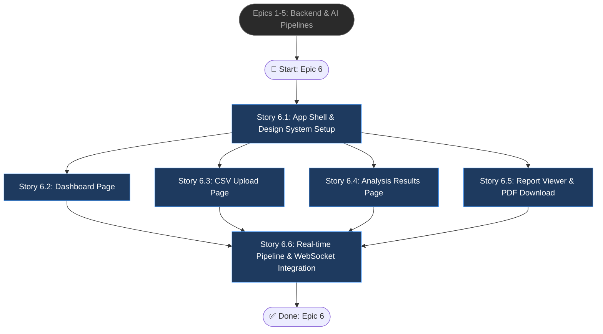

# Epic 6: Frontend Dashboard & UI

## Epic Objective

Xây dựng ứng dụng giao diện Next.js 14 với kiến trúc App Router, tuân thủ **"The Sovereign Intelligence Framework"** Design System — phong cách editorial, tonal layering, glassmorphism, và "No-Line" Rule. Bao gồm 4 trang chính (Dashboard, Upload, Analyses, Reports) cùng shared app shell (Sidebar + TopBar), kết nối chặt chẽ với Backend API (Epics 1-5). Mục tiêu: giao diện spacious, authoritative, intellectually calm — lấy cảm hứng "high-end editorial print" thay vì SaaS truyền thống.

## Design System Reference

Tất cả stories trong epic này tuân thủ Design System Document: **"The Sovereign Intelligence Framework"** (xem `{frontend}/UI/*/DESIGN.md`).

### Color Tokens (Tailwind Config)
| Token | Hex | Usage |
|---|---|---|
| `surface` | #f7f9fc | Base layer background |
| `surface-container-low` | #f2f4f7 | Secondary workspace |
| `surface-container-lowest` | #ffffff | Interactive cards |
| `primary` | #24389c | CTAs, active states |
| `primary-container` | #3f51b5 | Gradient end |
| `secondary` | #006a6a | Success, comparisons |
| `secondary-container` | #90efef | Running status badges |
| `error` | #ba1a1a | Failed states |
| `error-container` | #ffdad6 | Error backgrounds |
| `tertiary-fixed-dim` | #fbbc00 | Amber highlights/warnings |
| `on-surface` | #191c1e | Primary text (never pure black) |
| `on-surface-variant` | #454652 | Secondary text, labels |
| `outline-variant` | #c5c5d4 | Ghost borders (15% opacity only) |

### Key Design Rules
- **No-Line Rule**: No 1px solid borders for layout — use background color shifts only
- **Signature Gradient**: CTAs use `linear-gradient(135deg, #24389c, #3f51b5)`
- **Glassmorphism**: Navigation/headers use 85% opacity + `backdrop-filter: blur(10px)`
- **Typography**: Inter font family, Display (3.5rem) for hero metrics, Labels uppercase with 0.05em tracking
- **Tonal Layering**: Depth via surface color hierarchy, not drop-shadows
- **Ghost Borders**: If border needed, `outline-variant` at 15% opacity only

## Flowchart

## Stories

### Story 6.1: App Shell & Design System Setup

As a developer,
I want to scaffold the Next.js 14 App Router project with shared layout components (Sidebar, TopBar) and the Sovereign Intelligence design system tokens,
so that all pages share consistent navigation, typography, color tokens, and glassmorphism styling.

#### Acceptance Criteria

1: Khởi tạo project Next.js 14 (App Router, TypeScript, TailwindCSS) tại `{frontend}/` với cấu trúc `app/`, `components/`, `lib/`, `hooks/`.
2: Cấu hình Tailwind config với toàn bộ **color tokens** theo Design System (surface, primary, secondary, error, tertiary, outline-variant, on-surface, ...) — sử dụng chính xác hex values từ design.
3: Cấu hình font family **Inter** (wght 100-900) qua Google Fonts, áp dụng `font-headline`, `font-body`, `font-label` aliases.
4: Xây dựng component `SideNavBar` (fixed left, width 264px):
   - Logo block "Sovereign Intelligence" (font-black, uppercase, tracking-tighter) + tagline "Intelligence Framework v1.0" (10px, tracking 0.2em)
   - 4 nav items chính: Dashboard (dashboard icon), Upload (cloud_upload), Analyses (analytics), Reports (description) — dùng Material Symbols Outlined
   - Active tab: bg-white, text-indigo-700, shadow-sm, rounded-lg; icon filled (FILL 1)
   - Inactive tabs: text-slate-500, hover: text-indigo-600, hover bg-slate-200/50
   - Bottom section (border-t): Settings + Support links
   - Font: 13px, font-medium, tracking-wide, uppercase
5: Xây dựng component `TopAppBar` (fixed top, left-64, glassmorphism):
   - Background: `bg-slate-50/85 backdrop-blur-md`, height 64px
   - Left: Search input (rounded-full, pl-10, bg-slate-200/40, placeholder "Search parameters...")
   - Right: Export PDF button (primary style), Notification icon, Help icon, User avatar (rounded-full, 32px)
6: Tạo `RootLayout` component tích hợp SideNavBar + TopAppBar, main content area `ml-64 pt-20 p-12 min-h-screen`.
7: Implement CSS utilities: `.glass-panel` (rgba 80% + blur 12px), `.signature-gradient` (linear-gradient 135deg), `.no-scrollbar`.
8: Setup API client service (`lib/api.ts`) với base URL cấu hình qua environment variable, chuẩn bị cho các API calls từ Epics 1-5.

### Story 6.2: Dashboard Page

As a user,
I want a dashboard showing hero metrics, intelligence trends chart, and recent analyses activity stream,
so that I have an authoritative overview of my data intelligence operations at a glance.

#### Acceptance Criteria

1: **Hero Metrics Header** — Phần header hiển thị:
   - Overline: "OPERATIONAL OVERVIEW" (11px, font-bold, primary, tracking 0.3em, uppercase)
   - Title: "System Intelligence" (4xl/text-4xl, font-extrabold, tracking-tight)
   - Right side metadata: "Last Sync" + "Nodes Active" (10px uppercase labels, giá trị semibold)
2: **Bento Grid Hero Metrics** (grid-cols-12, gap-6, 3 cards mỗi card col-span-4):
   - **Total Datasets** card: `surface-container-lowest`, rounded-xl, p-8, shadow-sm. Label (12px uppercase tracking-widest) với dot indicator `bg-primary`. Số lớn (5xl font-black). Trend indicator (xs font-bold, text-secondary, icon trending_up). Progress bar (h-1, signature-gradient). Background watermark icon (opacity-5, 8xl, scale on hover).
   - **Total Reports** card: Tương tự nhưng dot `bg-secondary`, mô tả text thay progress bar.
   - **Anomaly Detection** card: Thêm `border-l-4 border-tertiary-fixed-dim`. Dot `bg-tertiary-fixed-dim`. Giá trị hiển thị dạng percentage. Badge "CRITICAL THRESHOLD" (bg-error-container, text-on-error-container, 10px font-bold).
3: **Intelligence Trends Chart** (col-span-8, bg-surface-container-low, rounded-xl, p-8):
   - Header: "Intelligence Trends" (lg font-bold) + subtitle (xs text-on-surface-variant)
   - Legend: Primary (dot bg-primary) + Secondary (dot bg-secondary) — 11px uppercase
   - Chart area (h-64): SVG line chart với area gradient fill (primary at 10% opacity fading to 0%). Primary trend line (solid, stroke-width 3, primary color). Secondary trend line (dashed, stroke 006a6a). Interactive data points (circle với pulse ring).
   - Grid lines: outline-variant at 10% opacity
   - Tooltip: inverse-surface background, inverse-on-surface text, 10px font-bold
   - X-axis labels: Mon-Sun (10px uppercase tracking 0.2em)
   - **Lưu ý implementation**: Sử dụng Recharts library thay SVG mock cho production.
4: **Recent Analyses** sidebar (col-span-4, surface-container-lowest, rounded-xl, shadow-sm, full height):
   - Header: "Recent Analyses" (lg font-bold) + "Live system activity stream" (xs)
   - 5 analysis items, mỗi item: title (sm font-bold), status badge, description (11px), divider (surface-container-low)
   - **Running** badge: bg-secondary-container, text-on-secondary-container, animate-pulse, dot indicator + progress bar (h-1, bg-secondary)
   - **Completed** badge: bg-surface-container-high, text-on-secondary-container, check_circle icon
   - **Failed** badge: bg-error-container, text-on-error-container, error icon, shadow glow (rgba 186,26,26,0.2). "RETRY JOB" link (10px, text-primary, underline)
   - Footer: "View Historical Ledger" button (10px uppercase tracking-widest)
5: **Info Cards Row** (grid-cols-2, gap-6, below chart):
   - "Cluster Health" card: icon trong signature-gradient container, title sm font-bold, description xs, "VIEW MAP VIEW" link (10px uppercase primary)
   - "Threat Neutralization" card: icon trong bg-secondary-container, tương tự layout
6: **FAB** (Floating Action Button): fixed bottom-8 right-8, 56px rounded-full, signature-gradient, white add icon (FILL 1), shadow-2xl, hover scale-110, active scale-95.
7: Fetch dữ liệu từ API: `GET /api/v1/datasets` (count), `GET /api/v1/analysis` (recent 5), aggregate anomaly rate. Loading skeleton states theo design system.

### Story 6.3: CSV Upload Page

As a user,
I want to drag-and-drop CSV files, preview structure data, select data archetype and AI model before initializing analysis,
so that I can verify and configure my data ingestion accurately.

#### Acceptance Criteria

1: **Page Header**:
   - Breadcrumb overline: "SYSTEM INTELLIGENCE / DATA PIPELINE" (10px uppercase tracking 0.2em, primary)
   - Title: "Ingest Intelligence" (4xl font-bold tracking-tight)
   - Right: Italicized quote (sm, text-on-surface-variant, max-w-xs, right-aligned)
   - TopBar tab indicator: "Data Ingestion" (text-indigo-700, border-b-2 border-indigo-600)
2: **CSV Data Ingestor** (col-span-8, surface-container-lowest, rounded-xl, p-8, shadow-sm):
   - Header: upload_file icon (primary) + "CSV Data Ingestor" (lg font-bold)
   - Decorative glow: absolute top-right gradient blur circle (primary/5, hover primary/10)
   - **Drag-Drop Zone**: border-2 border-dashed border-primary/20, bg-surface-container-low, rounded-xl, p-12, center aligned
     - Circle icon container (w-16 h-16, bg-white, rounded-full, shadow-sm, add icon primary 3xl, hover scale-110)
     - "Drop your CSV file here" (font-semibold) + "or click to browse" (xs)
     - Constraints row: 3 items với check_circle icons — "MAX 50MB", "CSV/UTF-8", "HEADERS REQ." (10px uppercase tracking-widest, text-outline)
   - Hover state: border-primary/50, bg-primary-fixed/30
   - Active drop state: shift to `primary-fixed` (#dee0ff)
3: **Validation Error Display**: bg-error-container/30, rounded-lg, report icon (text-error), message (xs, text-on-error-container, font-medium). Hiển thị khi file invalid (encoding, size, format).
4: **Structure Preview** component (surface-container-lowest, rounded-xl, shadow-sm):
   - Header bar: bg-surface-container-low, table_view icon (primary), "Structure Preview" (sm font-bold) + "(First 10 Rows)" label, "DOWNLOAD TEMPLATE" link (10px uppercase primary)
   - Data table (Fluid Row style — no borders):
     - Header row: bg-surface-container-low/50, cells 10px uppercase tracking-widest font-bold text-on-surface-variant
     - Columns: Index, Timestamp (font-mono), Sensor_ID, Reading_V1, Confidence
     - Body rows: hover bg-surface-container-low, divider outline-variant/10, text xs
     - Confidence values: badge style (bg-secondary-container/30, text-on-secondary-container, 10px font-bold, rounded-full)
   - Gọi `GET /api/v1/upload/{id}/preview` để fetch 10 dòng đầu sau khi upload thành công.
5: **Inferred Data Archetype** panel (col-span-4, surface-container-lowest, rounded-xl, p-6, shadow-sm):
   - Title: "INFERRED DATA ARCHETYPE" (xs uppercase tracking 0.2em)
   - 3 radio options (vertical stack, gap-3):
     - **Timeseries** (selected): bg-primary/5, timeline icon (primary), title sm font-bold, subtitle 10px. Radio input text-primary.
     - **Tabular**: bg-surface-container-low, grid_on icon (outline), hover bg-surface-container-high
     - **Mixed**: bg-surface-container-low, hub icon (outline), hover bg-surface-container-high
   - Auto-selected by `DataService.detect_data_type()` API response, user có thể override.
6: **Architectural Backend** panel (ModelSelector, surface-container-lowest, rounded-xl, p-6, shadow-sm):
   - Title: "ARCHITECTURAL BACKEND" (xs uppercase tracking 0.2em)
   - Select dropdown (bg-surface-container-high, border-none, rounded-lg, p-3): options "Auto-Select Optimized", "TranAD (Transformer Anomaly)", "BiLSTM (Neural Recurrent)", "Isolation Forest"
   - Description text (11px, text-on-surface-variant)
   - **Pre-training Intensity** indicator: label (11px uppercase font-bold) + value (11px font-mono primary), progress bar (h-1.5, bg-primary, rounded-full)
7: **"Initialize Analysis" CTA** button: w-full, signature-gradient, text-white font-bold, py-4, rounded-xl, shadow-lg shadow-primary/20, bolt icon, hover scale-98. Disclaimer text below (10px, text-outline).
   - Gọi `POST /api/v1/upload` → sau khi thành công gọi `POST /api/v1/analysis/detect` hoặc `POST /api/v1/pipeline/run`.
8: **Bottom Info Cards** (grid-cols-3, gap-6):
   - "Encrypted Pipeline": security icon (primary), description xs
   - "Edge Computation": memory icon (secondary), description xs
   - "Feature Synthesis": auto_awesome icon (tertiary), description xs
   - Mỗi card: bg-surface-container-low, rounded-xl, p-6, icon trong bg-white rounded-lg shadow-sm

### Story 6.4: Analysis Results Page

As a user,
I want to see anomaly detection results with visual heatmaps, highlighted anomaly rows, and score distribution charts,
so that I can quickly identify and investigate problematic data points.

#### Acceptance Criteria

1: Page layout tuân thủ design system: overline breadcrumb + title "Analysis Intelligence" style tương tự Upload page.
2: **Score Heatmap** component: biểu đồ nhiệt (Recharts hoặc D3.js) hiển thị anomaly scores per-row/per-feature. Color palette: primary cho normal, tertiary-fixed-dim cho medium, error cho high anomaly. Tooltip: inverse-surface background.
3: **Anomaly Table** (Fluid Row style — theo đúng design system):
   - Header: 10px uppercase tracking-widest font-bold text-on-surface-variant, bg-surface-container-low/50
   - Rows: hover bg-surface-container-low, dividers outline-variant/10
   - Anomaly rows highlighted: bg-error-container/20 với left border-4 border-error
   - Columns: Row Index, anomaly_score (tabular-nums, right-aligned), contributing_features, risk level badge
   - **Status Badges** cho risk level: High (bg-error-container, text-on-error-container), Medium (bg-tertiary-fixed/30, text-tertiary), Low (bg-secondary-container/30, text-on-secondary-container)
   - Pagination component
4: **Anomaly Score Distribution** chart: bar chart (Recharts) hiển thị phân bố density. Chart palette: primary cho main, tertiary-fixed-dim cho highlights. Grid lines outline-variant/10.
5: **Filter & Sort** controls: filter theo score range, sort theo anomaly_score hoặc row_idx. Input fields dùng surface-container-highest track, focus state 2px Ghost Border primary.
6: Gọi `GET /api/v1/analysis/{id}/results` để fetch anomaly data. Loading states và empty states theo design system.

### Story 6.5: Report Viewer & PDF Download

As a user,
I want to view the AI-generated NLP report in editorial document format, configure language and detail level, and download as PDF,
so that I can read and present analytical insights to stakeholders in a professional format.

#### Acceptance Criteria

1: **Report Configuration Bar** (top, bg-surface-container-low, rounded-xl, p-4, flex justify-between):
   - Left group:
     - **Language Output** toggle: label (10px uppercase tracking-wider), toggle group (bg-surface-container-highest p-1 rounded-lg): "English" (active: bg-white shadow-sm text-primary) / "Vietnamese"
     - **Depth of Analysis** toggle: "Summary" / "Detailed" — tương tự toggle style
   - Right group:
     - Model indicator: bg-secondary-container/30, border secondary/10, pulse dot animation (secondary), "Model: Qwen2.5-7B Optimized" (xs font-semibold)
     - Refresh button: hover bg-surface-container-high
   - Gọi lại `NLPService.generate_report()` khi user thay đổi language hoặc style.
2: **Document Viewer** (flex-1, max-w-4xl, bg-surface-container-lowest, p-16, shadow-sm, min-h 1100px):
   - Subtle watermark: absolute top-right, opacity 3%, font-black, rotate-12, "SOVEREIGN"
   - **Prose styling** (Markdown rendered):
     - Report overline: "Strategic Intelligence Report" (11px, font-black, uppercase, tracking 0.2em, primary)
     - h1: 2.75rem, font-weight 800, tracking -0.02em, on-surface
     - h2: 1.5rem, font-weight 700, primary color, margin-top 2rem
     - p: 0.875rem, line-height 1.7, on-surface-variant
     - strong: on-surface, font-weight 600
     - blockquote: border-left 4px primary-container, bg-surface-container-low, padding 1rem, italic
     - ul/li: list-disc, text-sm, on-surface-variant
   - Metadata bar (below title): "Generated At" + "Data Confidence" — 10px labels, xs values, divider w-px h-8 outline-variant/20
   - Embedded charts/images trong report body: bg-surface-container-low, rounded-xl, p-6
   - Footer: border-t outline-variant/10, "Sovereign Intelligence | Confidential" + "Page X of Y" (10px uppercase tracking-widest)
3: **Export Preview** sidebar (w-80, right side):
   - **PDF Preview card** (bg-surface-container-low, p-6, rounded-2xl, shadow-sm):
     - Title: "EXPORT PREVIEW" (xs uppercase tracking-widest)
     - Thumbnail preview: aspect-[3/4], rounded-xl, bg-white, shadow-lg, border outline-variant/10
     - Hover overlay: bg-primary/20, "Full Preview" label (bg-white, rounded-full, text-primary, zoom_in icon)
     - **"Download PDF" button**: w-full, gradient from-primary to-primary-container, text-on-primary, rounded-xl, font-bold, shadow-md, hover shadow-lg, download icon
     - Disclaimer (10px center, text-on-surface-variant)
   - Gọi `GET /api/v1/report/{id}/download` để stream PDF.
4: **Report Context** panel (bg-surface-container-highest/50, p-6, rounded-2xl):
   - Title: "REPORT CONTEXT" (xs uppercase tracking-widest)
   - Processing Time: progress bar (h-1.5, bg-secondary) + value (10px font-bold)
   - Metadata rows (border-b outline-variant/20): Token Count, Context Window, Creativity (Temp) — label (xs on-surface-variant) + value (xs font-bold on-surface)
5: **"Need a revision?" card** (bg-white, border outline-variant/30, rounded-2xl, centered):
   - smart_toy icon (FILL 1) trong bg-primary-fixed rounded-full container
   - Title: "Need a revision?" (xs font-semibold)
   - Description (10px, on-surface-variant)
   - "Ask Question" button: border-primary, text-primary, hover bg-primary-fixed

### Story 6.6: Real-time Pipeline & WebSocket Integration

As a user,
I want to see real-time pipeline progress with step-by-step status updates across all pages,
so that I can monitor long-running backend analyses transparently.

#### Acceptance Criteria

1: Custom hook `useWebSocket` kết nối tới FastAPI WebSocket endpoint, nhận realtime status events (pipeline step changes, completion, errors).
2: **Pipeline Progress** component tái sử dụng: step progress bar động hiển thị 5 bước Celery (Preprocess → Detect → Fix → Report → PDF). Mỗi step: icon + label, active step highlighted (primary), completed (secondary check), failed (error).
3: **Pipeline Config** form (trước khi chạy): options `auto_fix` (toggle), `language` (English/Vietnamese), `report_style` (Summary/Detailed). Style: inputs dùng surface-container-highest track, focus 2px Ghost Border primary.
4: Tích hợp realtime status vào **Dashboard** (Recent Analyses list: Running items cập nhật progress bar tự động) và **Upload page** (sau khi Initialize Analysis, hiển thị pipeline progress inline).
5: Render raw logs panel (expandable) và error notifications (bg-error-container, error icon) khi Celery worker bị drop/failed. Toast notification style: bg-inverse-surface, text-inverse-on-surface, rounded-xl, shadow-2xl.
6: Gọi `POST /api/v1/pipeline/run` để start pipeline, `GET /api/v1/pipeline/{id}/status` polling fallback nếu WebSocket disconnect.

## Dependencies

- **Epic 1**: Backend project scaffold và REST API health endpoint đã sẵn sàng
- **Epics 2-5**: Tất cả API endpoints (upload, detect, report, pipeline) hoạt động và trả JSON response
- **WebSocket**: FastAPI WebSocket endpoint cho pipeline status (Epic 5)
- **Design Assets**: UI reference tại `{frontend}/UI/` — screenshots + HTML prototypes + DESIGN.md

## Additional Notes

- **Light mode** là mặc định theo Design System (surface #f7f9fc, text #191c1e). Dark mode support optional (via Tailwind `dark:` classes, đã có trong HTML prototypes).
- **Icon Library**: Material Symbols Outlined (Google Fonts), không dùng icon set khác.
- **No-Line Rule nghiêm ngặt**: Không sử dụng 1px solid borders cho layout sectioning. Chỉ dùng background color shifts và tonal layering.
- **Typography hierarchy**: Display (3.5rem hero numbers) → Headline (page titles) → Title (card headers) → Body (0.875rem data) → Label (10px metadata, uppercase + tracking).
- **Status Badge conventions**: Running = secondary-container + pulse, Completed = surface-container-high + check_circle, Failed = error-container + error icon + glow shadow.
- **Libraries**: Next.js 14, React 18, TailwindCSS (custom config), Recharts (charts), Material Symbols Outlined (icons), Inter (typography).
- **HTML Prototypes**: Tham khảo chi tiết implementation tại `{frontend}/UI/*/code.html` — đây là pixel-perfect reference cho mỗi page.
