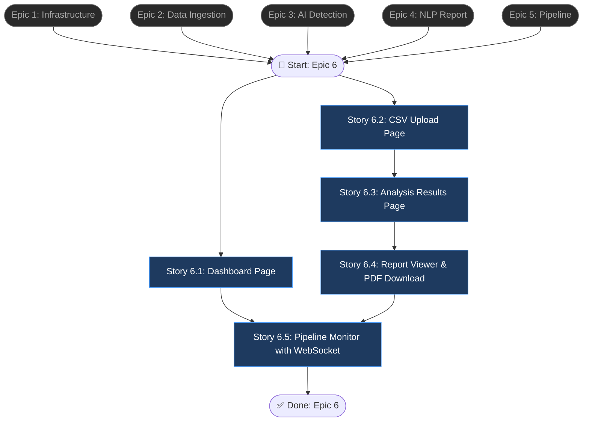

# Epic 6: Frontend Dashboard & UI

## Epic Objective

Xây dựng ứng dụng Next.js 14 với App Router, bao gồm 5 trang chính (Dashboard, Upload, Analysis, Report, Pipeline) với giao diện hiện đại dark-mode. Frontend kết nối với backend API đã xây ở Epic 1-5, cung cấp trải nghiệm end-to-end cho người dùng: từ upload CSV đến xem báo cáo phân tích. WebSocket cho realtime pipeline monitoring.

## Flowchart

## Stories

### Story 6.1: Dashboard Page

As a user,
I want a dashboard showing overview statistics and recent analyses,
so that I have a quick glance at my data activity.

#### Acceptance Criteria
1. Route: `/dashboard` (protected — redirect to `/login` if not authenticated)
2. Stats cards: tổng datasets uploaded, tổng analyses run, average anomaly ratio
3. Recent analyses list: 5 analyses gần nhất với columns: dataset name, model used, anomaly count, status, date
4. Click vào analysis → navigate to `/analysis/{id}`
5. Donut chart: phân bố data types (tabular vs timeseries vs mixed)
6. Bar chart: anomaly counts theo thời gian (7 ngày gần nhất)
7. Responsive layout: 2-column grid trên desktop, stack trên mobile
8. Dark mode styling với accent colors

### Story 6.2: CSV Upload Page

As a user,
I want to drag-and-drop CSV files and preview data before analysis,
so that I can verify the correct file is uploaded.

#### Acceptance Criteria
1. Route: `/upload` (protected)
2. `CSVUploader` component: drag-drop zone với visual feedback (border highlight, icon change)
3. File validation client-side: chỉ chấp nhận `.csv`, max 100MB, hiển thị error message
4. Upload progress bar (percentage)
5. Sau upload thành công: hiển thị `CSVPreview` với data table 10 dòng
6. `DataTypeIndicator` badge: hiển thị detected type (tabular/timeseries/mixed) với icon
7. `ModelSelector` dropdown: Auto (recommended) | BiLSTM | TranAD | AnoGAN
8. Button "Run Analysis" → call `POST /api/v1/analysis/detect` → redirect to analysis page
9. Button "Run Full Pipeline" → call `POST /api/v1/pipeline/run` → redirect to pipeline page

### Story 6.3: Analysis Results Page

As a user,
I want to see anomaly detection results with visual heatmaps and highlighted rows,
so that I can quickly identify problematic data.

#### Acceptance Criteria
1. Route: `/analysis/{id}` (protected, verify ownership)
2. Summary header: model used, total rows, anomaly count, anomaly ratio, duration
3. `ScoreHeatmap` (Recharts): heatmap visualization của anomaly scores across rows/features
4. `AnomalyTable`: data table với rows sorted by anomaly score (descending), anomaly rows highlighted in red/orange
5. `AnomalyChart`: bar chart phân bố anomaly scores (histogram)
6. Filter controls: slider cho score threshold, toggle show anomalies only
7. Sort: by score, by row index, by specific feature
8. Metrics panel: precision, recall, F1, AUC (nếu có)
9. Button "Generate Report" → navigate to report generation

### Story 6.4: Report Viewer & PDF Download

As a user,
I want to view the generated NLP report and download it as PDF,
so that I can read and share analysis insights.

#### Acceptance Criteria
1. Route: `/report/{id}` (protected, verify ownership)
2. `ReportViewer`: render Markdown content thành styled HTML (react-markdown)
3. Language selector: toggle between Vietnamese and English (re-generate if needed)
4. Style selector: Summary vs Detailed
5. `PDFExport` button: download PDF, hiển thị loading spinner during generation
6. PDF preview: inline PDF viewer (iframe hoặc react-pdf)
7. Share button: copy link to report
8. Print-friendly CSS cho browser print

### Story 6.5: Pipeline Monitor with WebSocket

As a user,
I want to see real-time pipeline progress with step-by-step updates,
so that I can monitor long-running analyses.

#### Acceptance Criteria
1. Route: `/pipeline/{id}` (protected, verify ownership)
2. `PipelineProgress`: visual step progress bar với 5 steps, active step animated
3. Mỗi step hiển thị: name, status (pending/running/completed/failed), duration
4. `PipelineConfig` panel: hiển thị config đã chọn (auto_fix, language, report_style)
5. `useWebSocket` hook: connect to `ws://host/ws/pipeline/{id}`, auto-reconnect on disconnect
6. Fallback: nếu WebSocket không available, polling `GET /status` mỗi 3 giây
7. Khi completed: hiển thị links đến Analysis Results và Report
8. Khi failed: hiển thị error message với "Retry" button
9. Real-time log output panel (scrollable, auto-scroll to bottom)

## Dependencies
- **Epic 1-5**: Tất cả backend APIs phải sẵn sàng
- Next.js 14, React 18, TypeScript
- Recharts hoặc D3.js cho charts
- react-markdown cho report rendering

## Additional Notes
- Auth flow: Login page → JWT stored in httpOnly cookie hoặc localStorage
- API client: axios instance với interceptor cho auth token và error handling
- Global loading states và error boundaries
- SEO: proper meta tags, title per page
- Accessibility: keyboard navigation, aria labels, focus management
