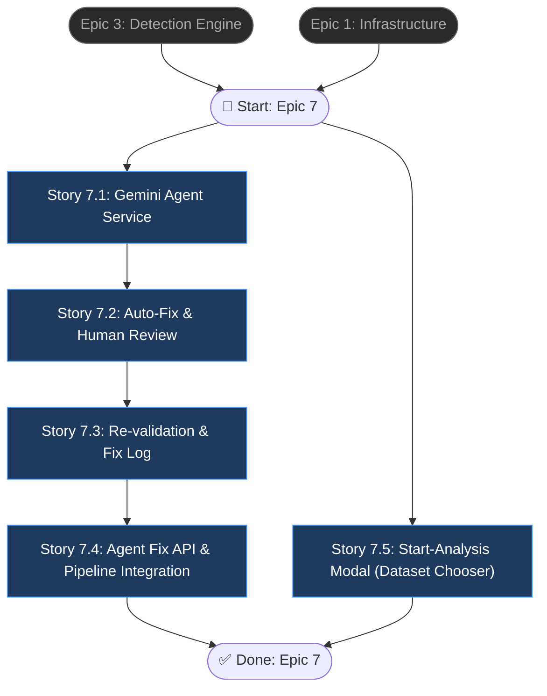

# Epic 7: Gemini Agent Auto-Fix Engine (Phase 2)

## Epic Objective

Xây dựng pipeline tự động sửa lỗi dữ liệu sử dụng **Gemini 1.5 Flash** làm suggestion engine. Nhận error list từ Epic 3 Detection Engine → AI Agent đề xuất fix → Auto-apply (confidence cao) hoặc Human Review (confidence thấp) → Re-validate bằng Rule Engine → Final Clean Data. Tối ưu chi phí bằng batch request, token reduction, và Redis cache layer. Mọi fix action được log vào `data_fix_log` cho audit và training future models.

## Architecture Overview

```
    DETECTION RESULTS (from Epic 3)
    ┌─────────────────────────────────┐
    │  get_fixable_rows() output:     │
    │  rows with errors + context     │
    └──────────┬──────────────────────┘
               ↓
    ┌─── Cache Lookup ───────────────┐
    │  Redis: (field, error, value)   │
    │  Hit → skip Gemini, reuse fix  │
    │  Miss → send to Gemini         │
    └──────────┬────────────────────────┘
               ↓
    ┌─── Gemini Agent Service ───────┐
    │  Batch 20 rows/request           │
    │  Only send error fields (tokens) │
    │  Gemini 1.5 Flash → suggestions  │
    │  confidence + fix_type per field  │
    └──────────┬────────────────────────┘
               ↓
    ┌─── Auto-Fix / Human Review ────┐
    │  confidence ≥ 0.9 → auto apply   │
    │  confidence < 0.9 → human review │
    └──────────┬────────────────────────┘
               ↓
    ┌─── Re-validation (Rule Engine) ┐
    │  Fixed rows → Rule Engine again  │
    │  Pass → Final Data               │
    │  Fail → re-queue (max 3 attempts)│
    └──────────┬────────────────────────┘
               ↓
    ┌─── Data Fix Log ──────────────┐
    │  Audit trail: every fix logged  │
    │  Export patterns → warm cache    │
    └──────────┬────────────────────────┘
               ↓
         FINAL CLEAN DATA
```

## Flowchart



## Stories

### Story 7.1: Gemini Agent Service (AI Fix Suggestion Engine)

As a data analyst,
I want an AI agent powered by Gemini to suggest corrections for detected errors,
so that data issues are fixed intelligently instead of just being flagged.

#### Acceptance Criteria
1. `{ai_services_detection}/src/agent/gemini_agent.py` implement `GeminiAgentService` class
2. Model: **Gemini 1.5 Flash** (rẻ + nhanh, tối ưu cho batch processing)
3. Prompt design với system prompt:
   ```
   You are a data cleaning assistant for Singapore real estate transaction data.
   Given: A CSV row with validation errors and context data.
   Task: 1. Suggest corrected values. 2. Do NOT hallucinate if unsure. 3. Return JSON only.
   Rules: Preserve original meaning. If confidence < 0.7 → set fix_type = "manual".
   ```
4. Context injection: Agent nhận domain knowledge từ `business_rules.yaml` (valid enums, field types, valid property types, representing values) và `column_mapping.yaml` (value_mappings cho status/txn_type normalization)
5. Input format — **batch request** (KHÔNG call từng row):
   ```json
   {
     "rows": [
       {
         "row_id": 1,
         "error_fields": {"transaction_type": "rentl", "status": "Drarf"},
         "errors": [
           {"field": "transaction_type", "error_type": "invalid_enum", "rule_section": "relationship_rules"},
           {"field": "status", "error_type": "invalid_enum", "rule_section": "relationship_rules"}
         ]
       }
     ],
     "context": {
       "valid_enums": {"transaction_type": ["sale", "lease", "rental", "project"], "status": ["finalized", "draft", "aborted"]},
       "valid_property_types": ["Industrial", "Apartment/Condo", "Commercial", "HDB", "Landed House"]
     }
   }
   ```
6. Output format per suggestion:
   ```json
   {
     "suggestions": [
       {
         "row_id": 1,
         "field": "transaction_type",
         "original_value": "rentl",
         "suggested_value": "rental",
         "confidence": 0.95,
         "fix_type": "auto",
         "reason": "Closest valid enum via edit distance"
       },
       {
         "row_id": 1,
         "field": "status",
         "original_value": "Drarf",
         "suggested_value": "draft",
         "confidence": 0.92,
         "fix_type": "auto",
         "reason": "Known typo from column_mapping value_mappings"
       }
     ]
   }
   ```
7. **Token reduction**: chỉ gửi `error_fields` (fields có lỗi + giá trị), không gửi full CSV row — giảm ~80% tokens
8. **Cache layer**: `{ai_services_detection}/src/agent/fix_cache.py` — Redis cache mapping `(field, error_type, original_value) → (suggested_value, confidence)`
   - VD: `("status", "invalid_enum", "Drarf") → ("draft", 0.92)` cached → skip Gemini
   - Known mappings từ `column_mapping.yaml` `value_mappings` section pre-warm cache on startup
   - Cache hit rate target: > 40% sau 1000 rows processed
9. **Rate limiting & retry**: exponential backoff khi Gemini API rate limit (429)
10. Batch size configurable (default: 20 rows/request) để tối ưu cost
11. Fallback: nếu Gemini unavailable → tất cả errors route to manual review (graceful degradation)

### Story 7.2: Auto-Fix Engine & Human Review Queue

As a data analyst,
I want high-confidence fixes applied automatically and low-confidence fixes sent to human review,
so that data is corrected efficiently while maintaining accuracy.

#### Acceptance Criteria
1. `{ai_services_detection}/src/agent/auto_fix_engine.py` implement `AutoFixEngine` class
2. Auto-fix logic:
   ```python
   if confidence >= 0.9 and fix_type == "auto":
       apply_fix(row, suggestion)  # Auto-apply
   else:
       send_to_review(row, suggestion)  # Human review queue
   ```
3. `apply_fix(row, suggestion)` cập nhật giá trị trong dataset (MinIO CSV), log vào `data_fix_log`
4. `send_to_review(row, suggestion)` thêm vào review queue với status `pending_review`
5. Review queue API:
   - `GET /api/v1/review/pending` — list pending fixes (paginated, filterable by dataset_id, field, confidence range)
   - `POST /api/v1/review/{fix_id}/approve` — approve fix, apply and log
   - `POST /api/v1/review/{fix_id}/reject` — reject suggestion, mark as `rejected`
   - `POST /api/v1/review/{fix_id}/override` — human provides custom fix value
6. Batch approve: `POST /api/v1/review/batch-approve` body: `{"fix_ids": [1, 2, 3]}`
7. Confidence threshold configurable (default: 0.9) qua config file
8. Dashboard-ready response format: mỗi pending fix chứa original_value, suggested_value, confidence, reason, row context (neighboring fields for reference)

### Story 7.3: Re-validation Loop & Data Fix Log

As a system administrator,
I want all fixed rows to be re-validated by the Rule Engine and all fix actions logged,
so that fixes are verified correct and there is a complete audit trail.

#### Acceptance Criteria
1. `{ai_services_detection}/src/agent/revalidation.py` implement `RevalidationService` class
2. **Re-validation loop**: sau mỗi fix (auto hoặc approved):
   ```
   Fixed Row → Rule Engine (Epic 3 Story 3.1) → Validate lại
   ├── Pass → mark as "fixed_verified", move to Final Data
   └── Fail → mark as "fix_failed", re-queue for Agent hoặc manual review
   ```
3. Reuse `RuleValidationEngine` từ Epic 3 — không duplicate logic
4. Max re-validation attempts configurable (default: 3) — tránh infinite loop
5. Nếu max attempts reached → mark as `requires_manual_intervention`
6. **Data Fix Log** — bảng `data_fix_log` trong database:
   ```sql
   CREATE TABLE data_fix_log (
     id INT AUTO_INCREMENT PRIMARY KEY,
     dataset_id VARCHAR(36) NOT NULL,
     row_id INT NOT NULL,
     field VARCHAR(100) NOT NULL,
     original_value TEXT,
     fixed_value TEXT,
     confidence FLOAT,
     fix_type ENUM('auto', 'manual', 'human_override'),
     source ENUM('gemini_agent', 'human_review', 'rule_based'),
     status ENUM('applied', 'verified', 'failed', 'rejected'),
     approved_by VARCHAR(100),
     attempt_number INT DEFAULT 1,
     created_at TIMESTAMP DEFAULT CURRENT_TIMESTAMP,
     INDEX idx_dataset_row (dataset_id, row_id),
     INDEX idx_status (status)
   );
   ```
7. Fix log dùng để:
   - **Audit**: truy vết mọi thay đổi data
   - **Training**: export fix patterns để fine-tune model hoặc enrich cache
   - **Analytics**: fix rate, auto-fix accuracy, most common error types
8. `export_fix_patterns()` trả về aggregated fix patterns (field, error_type, fix_count, avg_confidence) — dùng để warm cache và improve Agent prompt
9. Alembic migration tạo bảng `data_fix_log`

### Story 7.4: Agent Fix API & Pipeline Integration

As a user,
I want an API to run the fix pipeline on detection results and integrate with the full pipeline,
so that I get corrected data end-to-end.

#### Acceptance Criteria
1. `POST /api/v1/agent/suggest-fix` body:
   ```json
   {
     "dataset_id": "...",
     "analysis_id": "...",
     "auto_fix_enabled": true
   }
   ```
   - Pipeline: load fixable rows (Epic 3 `get_fixable_rows()`) → cache lookup → Gemini batch → auto-fix/review → re-validate → save results
2. `GET /api/v1/analysis/{id}/fix-results` trả về fix summary:
   ```json
   {
     "total_errors": 150,
     "total_fixed_auto": 95,
     "total_fixed_manual": 20,
     "total_pending_review": 25,
     "total_failed": 10,
     "cache_hit_rate": 0.43,
     "gemini_calls": 8,
     "fixes": [
       {
         "row_id": 1,
         "field": "transaction_type",
         "original": "rentl",
         "fixed": "rental",
         "confidence": 0.95,
         "source": "gemini_agent",
         "status": "verified"
       }
     ]
   }
   ```
3. Integration with Epic 5 pipeline: thêm `fix_data_task` Celery task vào chain sau `detect_anomalies_task`
   - Pipeline mở rộng: preprocess → detect → **fix** → report → PDF
4. `GET /api/v1/analysis/{id}/status` mở rộng thêm fix steps:
   ```json
   {
     "status": "running",
     "current_step": "agent_fix",
     "steps": ["rule_validation", "rule_scoring", "ml_detection", "decision", "agent_fix", "auto_fix", "revalidation"],
     "progress_pct": 71
   }
   ```
5. Kết quả lưu bổ sung vào `analysis_results`: total_fixed_auto, total_fixed_manual, total_pending_review, fix_duration_seconds
6. Celery async task cho fix pipeline (non-blocking API)
7. `auto_fix_enabled` flag — nếu `false`, chỉ suggest fixes, không auto-apply

### Story 7.5: "Start New Analysis" Modal — Dataset Chooser

As a data analyst,
I want a quick modal to pick an existing dataset (or upload a new one) when starting an analysis,
so that I don't have to re-upload CSVs that are already ingested in MinIO.

#### Acceptance Criteria
1. New component `{frontend}/components/StartAnalysisModal.tsx` with props `{ open: boolean; onClose: () => void; onStarted: () => void }` — no modal library added; dùng design tokens hiện có (`surface`, `primary`, `on-surface-variant`)
2. Modal header "Start New Analysis" + close button (X) top-right; ESC key và click overlay đều close modal mà KHÔNG start analysis
3. Section 1 — "Choose an existing dataset":
   - On mount gọi `getDatasets(true)` → `GET /api/v1/datasets?ready_only=true`
   - States: loading skeleton, empty ("No datasets yet — upload one"), error (có retry button)
   - Mỗi row hiển thị `filename` + `row_count × column_count` + `data_type` badge
   - Click row → `startAnalysis({dataset_id, archetype: "timeseries", model: "auto", pre_training_intensity: "high"})` → close modal + call `onStarted()`
   - Nếu `startAnalysis()` fail → inline error banner trong modal, modal KHÔNG close
4. Section 2 — Button "Upload new CSV" → `router.push("/upload")` (giữ flow cũ intact)
5. Backend — `{backend}/app/api/endpoints/datasets.py`: `GET /datasets` thêm query param `ready_only: bool = Query(default=False)`; khi `true` → filter `Dataset.data_type != "detecting"`; default `false` giữ nguyên behavior hiện tại
6. Frontend API client — `{frontend}/lib/api.ts`: `getDatasets(readyOnly?: boolean)` append `?ready_only=true` khi arg truthy
7. `{frontend}/app/(pages)/analyses/page.tsx`:
   - Thay 2 handler `onClick={() => router.push("/upload")}` (header "+ NEW" button và FAB) → `onClick={() => setModalOpen(true)}`
   - Render `<StartAnalysisModal />` cuối component với `onStarted={() => { setModalOpen(false); loadAnalyses(); }}`
8. Re-analyze idempotent: chọn cùng 1 dataset nhiều lần → tạo analysis record mới mỗi lần, không block
9. Unit tests:
   - Backend: `GET /datasets?ready_only=true` không trả dataset có `data_type="detecting"`
   - Frontend: click dataset → `startAnalysis` called với đúng default payload, `onStarted` fired

## Dependencies
- **Epic 3**: Detection Engine — `RuleValidationEngine` (reuse cho re-validation), `DecisionEngine.get_fixable_rows()` (input errors)
- **Epic 1**: Infrastructure — Database, Redis (cache layer + Celery broker), Docker
- **Epic 5**: Pipeline Orchestration — Celery chain integration (thêm fix task)
- **Gemini API**: Google AI API key cho Gemini 1.5 Flash — env var `GEMINI_API_KEY`
- **Config files**: `{ai_services_detection}/configs/business_rules.yaml` (valid enums, field types cho context injection), `column_mapping.yaml` (value_mappings cho cache pre-warming)
- `google-generativeai` Python SDK cho Gemini API calls

## Additional Notes
- **Phase 2 epic**: triển khai sau khi Epic 3 Detection Engine stable và tested
- **Gemini cost optimization** (cực quan trọng):
  - Batch 20 rows/request thay vì call từng row → giảm ~20x API calls
  - Chỉ gửi error fields, không gửi full row data → giảm ~80% tokens
  - Redis cache layer reuse fix patterns → target > 40% cache hit rate → giảm ~40% Gemini calls
  - Pre-warm cache từ `column_mapping.yaml` `value_mappings` (known typos: "Drarf" → "draft", "Projects" → "project")
  - Gemini 1.5 Flash là model rẻ nhất (~$0.075/1M input tokens), đủ cho data cleaning task
- **Auto-fix safety**: confidence threshold 0.9 là conservative — chỉ auto-apply khi rất chắc chắn
- **Re-validation bắt buộc**: mọi fix (auto + human) phải qua Rule Engine lại — đảm bảo fix không tạo lỗi mới
- **Fix log là gold mine**: dùng để audit, train future models, và warm Gemini cache
- **Graceful degradation**: nếu Gemini API down → tất cả errors route to manual review, platform vẫn hoạt động
- Stories 7.1 → 7.2 → 7.3 → 7.4 là sequential (each depends on previous)
- **Story 7.5 là parallel track** — UX improvement cho Analyses page, không phụ thuộc Gemini agent. Có thể implement song song hoặc trước 7.1. (Về mặt domain thì thuộc Epic 6 Frontend, nhưng được gộp vào đây theo yêu cầu để đồng bộ release.)
