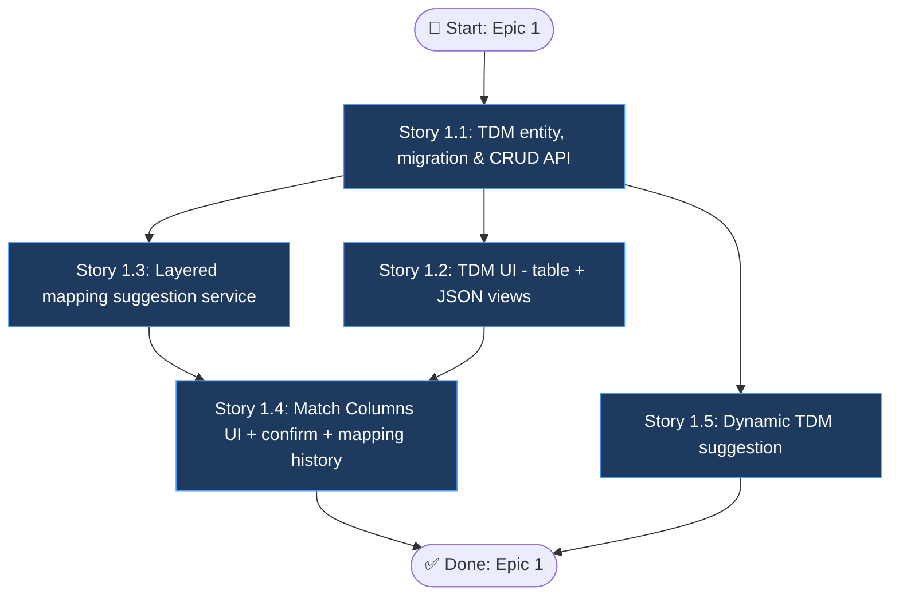

# Epic 1: Target Data Models & Column Mapping

> Source PRD: `final_project_ai/docs/interactive-data-preprocessing-prd.md`

## Epic Objective

Stand up Target Data Models (TDM) as first-class entities — explicit, reusable canonical schemas with typed columns and validations — and deliver an AI-layered column-mapping step (exact → historical → LLM → fuzzy) with confirmed mappings remembered per header signature. This epic unblocks everything downstream: validation and cleaning (Epic 3) are meaningless without a target schema, and pipeline automation (Epic 5) reuses the mapping history created here.

## Flowchart

## Stories

### Story 1.1: TDM entity, migration & CRUD API

As a data operator,
I want to define and manage Target Data Models with typed columns and validations,
so that every import has an explicit canonical schema to map into.

#### Acceptance Criteria

1: `target_data_models` table created via Alembic migration in `{backend}/alembic/versions/`; column definitions stored as ordered JSON in the Ingestro-compatible shape (`key`, `label`, `columnType`, optional `description`, `outputFormat`, `dropdownOptions` + `isMultiSelect`, `validations`)
2: Writes validate the JSON against the schema: supported `columnType` values are `string | int | float | date | email | phone | category | percentage | currency_code`; supported validations are `required`, `unique`, `regex` (+ `errorMessage`), `required_with`, `required_with_all`; a `category` column without `dropdownOptions` is rejected with a 422 and a field-level message
3: CRUD endpoints `GET/POST/PUT/DELETE /api/v1/tdm` (list, detail, create, update, delete) with pagination on list
4: The 4 existing rule sets in `{backend}/app/services/validation_service.py` (`real-estate-v1`, `commission-v1`, `invoice-v1`, `contact-v1`) are seeded as TDMs; existing `Template` records are data-migrated into TDMs and template endpoints keep responding as thin aliases (no frontend breakage)
5: Unit tests cover schema acceptance/rejection for representative definitions (valid full model, duplicate keys rejected, unknown columnType rejected, category without options rejected)

### Story 1.2: TDM UI (table + JSON views)

As a data operator,
I want to view and edit a TDM as a table or as raw JSON,
so that I can manage schemas in whichever form is faster.

#### Acceptance Criteria

1: TDM list page (name, column count, updated date) and detail page in `{frontend}` with a toggle between table view and raw-JSON view
2: Paste-JSON-to-create: pasting a valid definition array creates the TDM; invalid JSON or schema violations surface inline errors pointing at the offending column/field
3: Table view supports column add/edit/delete/reorder, including validations and dropdown options for `category` columns
4: Copy button exports the full JSON definition; rename via inline edit on the title
5: Jest tests for the JSON-parse/validate reducer and the table-edit state logic

### Story 1.3: Layered mapping suggestion service

As a data operator,
I want the system to propose column mappings automatically,
so that I only correct exceptions instead of mapping everything by hand.

#### Acceptance Criteria

1: `POST /api/v1/datasets/{id}/mapping/suggest` (body: `tdm_id`) returns per-source-column proposals: `{source_column, target_key | null, confidence, layer: exact|historical|llm|fuzzy}` implemented in a new `{backend}/app/services/mapping_service.py`
2: Layers execute in priority order — (1) exact/normalized name match (case, spacing, snake_case folding), (2) historical match from `mapping_history` by header signature and by individual header, (3) LLM semantic match, (4) fuzzy string match — first layer to produce a confident match wins
3: Matches below the configurable threshold (default 0.60, settable in app config) are returned with `target_key: null` (unmatched) for manual assignment
4: The LLM layer sends only column headers plus at most 5 sample values per column (NFR1) and is skipped entirely when the AI-disabled flag is set — the service degrades to fuzzy matching without error
5: Unit tests per layer with fixture files: exact-hit, historical-hit, semantic-hit (LLM mocked), fuzzy-hit, and no-hit below threshold

### Story 1.4: Match Columns UI + confirm + mapping history

As a data operator,
I want to review, adjust, and confirm the proposed mapping,
so that the import proceeds with a mapping I trust — and repeats automatically next time.

#### Acceptance Criteria

1: Match Columns wizard stage renders each source column with: a "Select or add column…" dropdown of TDM targets, the suggestion pre-selected with confidence badge and layer label, a data-quality readout (% rows with a value) and up to 3 sample values, and a visible flag on unmatched columns
2: "Create new column" in the dropdown opens an inline TDM-column creator (key/label/type) and appends it to the TDM on confirm
3: `POST /api/v1/datasets/{id}/mapping/confirm` persists the final mapping to `dataset_mappings` and upserts `mapping_history` keyed by header signature (ordered normalized source headers hashed per TDM); dataset `import_status` advances to `mapped`
4: Re-uploading a file with an identical header signature auto-maps at confidence 1.0 via the historical layer and the stage shows "auto-matched — review optional" instead of requiring per-column action
5: For `category` targets, source-value → dropdown-option assignments made by the user are captured at confirm and remembered in mapping history for the next import

### Story 1.5: Dynamic TDM suggestion

As a data operator onboarding a brand-new client format,
I want a draft TDM generated from my sample file,
so that I don't build the schema from scratch.

#### Acceptance Criteria

1: "Suggest TDM from file" action on the TDM list page (and as a shortcut inside the wizard when no TDM fits) produces a draft definition — keys, labels, inferred columnTypes, and obvious validations (e.g. `required` for fully-populated columns, `regex` for email-shaped columns) — opened in the TDM editor; nothing is saved without explicit user confirmation
2: The LLM receives only headers plus a capped number of sample rows (≤ 20); the action is hidden when the AI-disabled flag is set
3: Draft quality benchmark: on the real-estate sample files used by the detection pipeline, ≥ 80% of columns receive a sensible `columnType` without manual correction (documented as a repeatable check, LLM output recorded in fixtures)

## Dependencies

- None on other epics (this is the foundation epic); Epic 2 can proceed in parallel
- Gemini API access via the existing `{backend}/app/services/gemini_fix_service.py` wrapper pattern (Stories 1.3, 1.5)
- MySQL + Alembic migration workflow already in place
- New tables introduced here: `target_data_models`, `dataset_mappings`, `mapping_history`; `datasets` gains `tdm_id`, `import_status`

## Additional Notes

- `Template` is not deleted — it is migrated and aliased until the frontend fully switches to TDM endpoints; removal is a later cleanup task
- Header-signature definition (ordered list of normalized source headers, hashed per TDM) must be shared code between Stories 1.3/1.4 and later Epic 5 pipeline execution
- Mapping confidence threshold, AI on/off flag live in app config (env-overridable) per PRD Technical Assumptions
- Out of scope here: validation execution against the TDM (Epic 3) and any grid editing (Epic 4)
