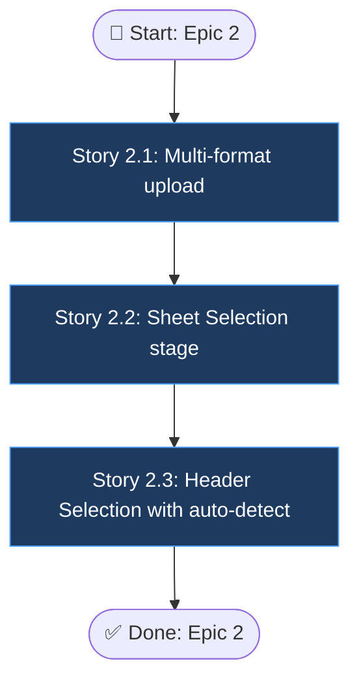

# Epic 2: Structure Detection for Multi-format Upload

> Source PRD: `final_project_ai/docs/interactive-data-preprocessing-prd.md`

## Epic Objective

Accept the file shapes real clients actually send — Excel workbooks with multiple sheets, files with title rows above the header, transposed layouts — and resolve the structure interactively (or automatically when confident), so that the Match Columns stage always starts from a correctly parsed grid. This epic extends the existing CSV-only upload endpoint into the Upload → Sheet Selection → Header Selection stages of the import wizard.

## Flowchart

## Stories

### Story 2.1: Multi-format upload

As a data operator,
I want to upload XLSX/XLS/TSV/PSV/ODS in addition to CSV,
so that I don't have to convert files manually.

#### Acceptance Criteria

1: `POST /api/v1/upload` in `{backend}/app/api/endpoints/upload.py` accepts `.csv`, `.xlsx`, `.xls`, `.tsv`, `.psv`, `.ods` with the existing 100 MB limit; the parser is selected by sniffing content (magic bytes / delimiter detection), not by extension alone
2: Corrupt, empty, or password-protected files are rejected with actionable error messages (e.g. "File appears to be password-protected — remove the password and re-upload"), never a bare 500
3: XLSX reads are memory-safe for large files (streamed/chunked via openpyxl read-only mode where possible) per NFR7
4: The existing CSV upload path is unchanged in behavior — covered by a regression test — and the response contract (dataset id, row/column counts, preview availability) is preserved for all formats
5: Uploaded raw file is stored in MinIO as today; `datasets.import_status` is set to `uploaded`

### Story 2.2: Sheet Selection stage

As a data operator,
I want to pick which worksheet to import,
so that multi-tab workbooks import the right data.

#### Acceptance Criteria

1: For multi-sheet workbooks, the wizard presents a sheet picker listing each sheet with its row and column counts; the user's choice determines the grid used by all later stages
2: Single-sheet files (and all delimiter-based formats) skip this stage automatically — the progress bar shows it as completed, and the user can still navigate back to change it for workbooks
3: The selected sheet is recorded in the import lineage record (NFR4) and exposed by the dataset detail endpoint
4: Switching sheets after later stages have been touched resets downstream state (header selection, mapping) with an explicit confirmation dialog

### Story 2.3: Header Selection with auto-detect

As a data operator,
I want to confirm (or let the system detect) the header row,
so that columns are named correctly before mapping.

#### Acceptance Criteria

1: Header Selection stage renders a raw grid preview with spreadsheet-style column letters (A, B, C…) and numbered rows; clicking a row selects it as the header, with rows above it excluded from data
2: Auto-detection proposes a header row with a confidence score (heuristics: type homogeneity below the candidate row, uniqueness and text-likeness of the candidate values); above the configurable threshold the stage is pre-completed but revisitable — Skip Header Step behavior
3: Advanced options: transpose rows/columns, and merge multiple consecutive header rows into one (values joined with a separator); both operations preview before applying
4: The confirmed header configuration (row index, transpose flag, merged rows) is recorded in lineage and contributes to the header signature used by mapping history (Epic 1); `import_status` advances to `structured`
5: The existing archetype detection (`tabular | timeseries | mixed` in `{backend}/app/services/data_service.py`) runs against the selected sheet + header configuration and its result is unchanged for current CSV fixtures (regression test)

## Dependencies

- Story 2.3 AC4 shares the header-signature code introduced in Epic 1 (Stories 1.3/1.4) — coordinate, but Stories 2.1–2.2 have no Epic 1 dependency and can run in parallel with Epic 1
- `openpyxl` (already a platform dependency) for XLSX/XLS; add ODS support library to `{backend}/requirements.txt`
- MinIO storage and existing upload wizard frontend in `{frontend}`

## Additional Notes

- PDF, nested JSON/XML parsing (Ingestro "Advanced Parsing") are explicitly out of scope per the PRD
- Multiple-file upload in one wizard session is out of scope for this epic (single file per import)
- Auto-detect thresholds are config values, not hardcoded, so Skip Header Step can be tuned per deployment
