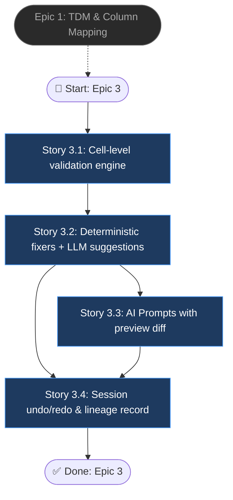

# Epic 3: Validation, Cleaning Assistant & AI Prompts

> Source PRD: `final_project_ai/docs/interactive-data-preprocessing-prd.md`

## Epic Objective

Convert validation from a one-shot report into an interactive cleaning loop: every issue is visible at cell level, explainable, and fixable — individually, in bulk per column/issue type, or via natural-language Prompts with a mandatory preview diff. Deterministic fixers run before any LLM call, LLM calls receive only error cells (data minimization), and anomaly signal is never altered: cleaning fixes format/schema/typo problems only, while outliers stay flagged and untouched for the downstream detection pipeline.

## Flowchart

## Stories

### Story 3.1: Cell-level validation engine

As a data operator,
I want validation errors reported per cell against the TDM,
so that I can see exactly what is wrong and where.

#### Acceptance Criteria

1: A validation engine (evolving `{backend}/app/services/validation_service.py`) checks mapped data against the TDM and supports all PRD FR1 validation types: missing-required, type mismatch per `columnType` (incl. `email`, `phone`, `date` with `outputFormat`), `regex` with custom `errorMessage`, `unique`, unknown `category` value, and cross-column `required_with` / `required_with_all`
2: Issues are persisted to a new `import_issues` table as `{dataset_id, row, column_key, issue_type, raw_value, message}`; a summary endpoint returns per-column and per-issue-type counts
3: A 50k-row dataset validates within the NFR3 budget (≤ 10 s), verified by a performance test
4: The existing `POST /api/v1/{dataset_id}/validate` endpoint (`{backend}/app/api/endpoints/validate.py`) is reimplemented on the new engine without breaking its response contract (regression test with the current Upload Wizard payloads)
5: Re-validation can target specific rows/columns (used later by grid edits) instead of always re-running the full dataset

### Story 3.2: Deterministic fixers + LLM suggestions

As a data operator,
I want suggested fixes for detected issues,
so that cleaning is one click instead of manual editing.

#### Acceptance Criteria

1: Rule-based fixers run first and are marked `source: rule`: date normalization to the TDM `outputFormat`, numeric coercion (strip currency symbols/thousand separators), whitespace/casing normalization, and category synonym mapping (incl. assignments remembered from Epic 1 confirm); each produces `{row, column_key, proposed_value, confidence}`
2: Issues left unresolved by rules are optionally sent to Gemini via the existing service wrapper — batched, error cells only with minimal row context (NFR1) — returning proposals marked `source: llm` with confidence; when the AI-disabled flag is set, this step is skipped silently
3: Suggestions can be applied one-by-one, all-per-column, or all-per-issue-type; every application writes a `transform_log` entry (original value, new value, actor, timestamp) and re-validates the affected cells
4: Numeric values flagged as outliers (`is_outlier_*`) are excluded from fix suggestions — they are flagged, never altered — with a test proving an extreme price is not "corrected"
5: The UI shows an explicit AI-processing notice the first time LLM suggestions are requested in a session (NFR1)

### Story 3.3: AI Prompts with preview diff

As a data operator,
I want to describe a bulk edit in natural language and preview it before applying,
so that complex transforms don't require exports to Excel.

#### Acceptance Criteria

1: A Prompts input at the Review stage sends the instruction plus TDM schema (headers only, no full data) to the LLM, which returns a transform executed against the working data copy in a sandboxed executor — no I/O, no imports, whitelisted pandas-style operations only
2: The result renders as a preview diff: affected-row count and a before/after sample (≥ 10 rows or all affected if fewer); nothing is applied without explicit approval
3: Applied prompts are logged in `transform_log` with prompt text, the generated transform, and affected-row count; undo restores the pre-prompt state exactly
4: Failure modes are handled gracefully: an un-executable or rejected transform returns a readable error (not a stack trace); a transform affecting zero rows shows a warning instead of a silent no-op
5: The feature is hidden when the AI-disabled flag is set

### Story 3.4: Session undo/redo & lineage record

As a data operator,
I want to undo mistakes and see what was changed,
so that cleaning is safe to explore.

#### Acceptance Criteria

1: Undo/redo works across all mutation kinds in an import session — suggestion applications, prompt applications, and manual cell edits — in strict reverse order
2: A lineage record per import (NFR4) is assembled from: source file → sheet → header config → confirmed mapping → ordered `transform_log` entries, sufficient to replay the import deterministically (LLM steps replayed from logged outputs, not re-queried)
3: The lineage is retrievable via API (`GET /api/v1/datasets/{id}/lineage`) and rendered as a simple timeline in the UI
4: Integration test: apply rule fix + LLM fix (mocked) + prompt + manual edit, undo twice, redo once — lineage and data state match expectations

## Dependencies

- **Epic 1 complete** — validation and cleaning require a confirmed TDM mapping (`dataset_mappings`); category synonym memory comes from Story 1.4
- Gemini access through the single service wrapper (Stories 3.2, 3.3); AI on/off flag from Epic 1 config work
- New tables: `import_issues`, `transform_log`
- Outlier flags (`is_outlier_*`) computation reuses logic from `{ai_services_detection}/src/data`

## Additional Notes

- The sandboxed executor for Prompts is the highest-risk component (LLM-generated code): whitelist-based design, no filesystem/network access, execution time capped; security review required before merge
- Deterministic-fixers-first ordering is both a cost and a trust decision — LLM spend only on residual issues
- Cleaning must never impute values for anomaly-relevant numeric columns beyond what the user explicitly approves; silent imputation (the old `MissingValueHandler` behavior) is retired in Epic 4 Story 4.3
