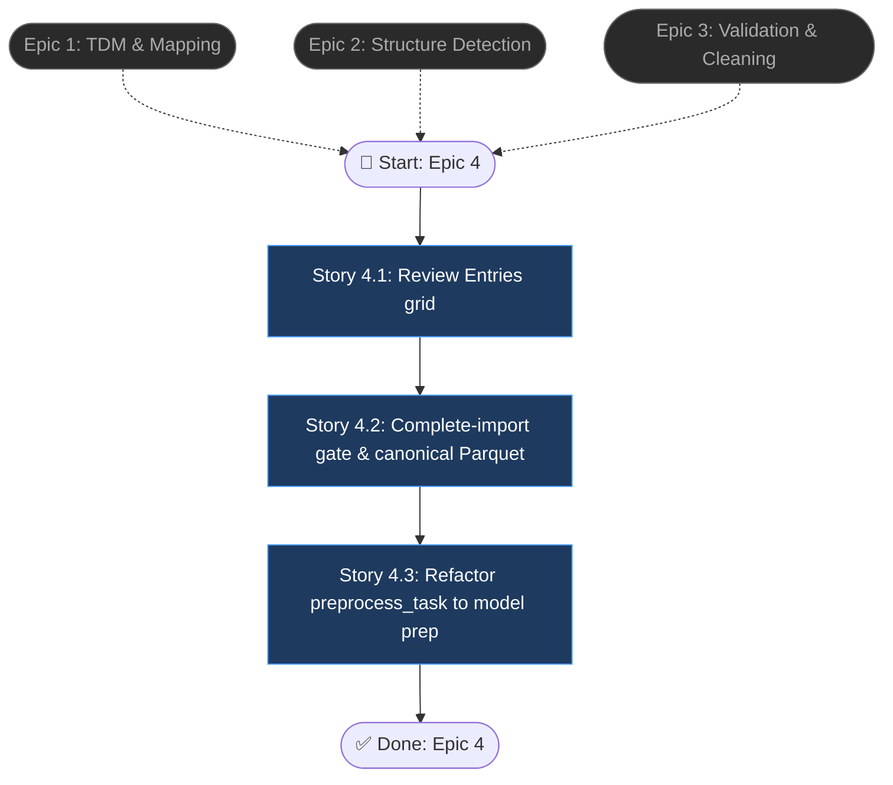

# Epic 4: Review Entries & Confirm Gate

> Source PRD: `final_project_ai/docs/interactive-data-preprocessing-prd.md`

## Epic Objective

Give users a final, trustworthy checkpoint — an editable Excel-like grid over the canonical data — and make their "Complete import" the single trigger of the ML analysis pipeline. This epic also performs the architectural pivot of the whole initiative: `preprocess_task` stops doing silent business cleaning and becomes model-prep-only, consuming the human-confirmed canonical Parquet, cleanly separating the two preprocessing tiers.

## Flowchart

## Stories

### Story 4.1: Review Entries grid

As a data operator,
I want an Excel-like grid over the mapped, cleaned data,
so that I can make final edits and verify the import.

#### Acceptance Criteria

1: The Review Entries stage renders TDM columns with required-column markers (starred/highlighted); cells with open issues are highlighted with tooltip messages from `import_issues`
2: Grid tooling: total error count, "Find error" navigation (jump to next error cell), row filter (all / rows-with-errors / valid), column sort, find & replace, undo/redo wired to the Epic 3 session mechanism
3: Cell edits re-validate only the affected cells inline (Story 3.1 AC5) and update the error count without a full-grid refresh
4: Performance within NFR3 on 50k rows via virtualized rendering (only visible rows mounted); grid edits reflect in < 200 ms with server round-trips async
5: `category` columns edit via dropdown of TDM options; `date` columns display in the TDM `outputFormat`

### Story 4.2: Complete-import gate & canonical Parquet

As a data operator,
I want "Complete import" to finalize the data and start the analysis,
so that only confirmed data enters the ML pipeline.

#### Acceptance Criteria

1: "Complete import" is blocked while required-column errors remain, showing which columns/counts block it; a per-TDM setting switches the behavior to warn-and-proceed instead of block
2: On confirm: the canonical Parquet — human-readable values, TDM keys as column names, plus `is_outlier_*` flags where applicable — is written to MinIO as `*_canonical.parquet`; `datasets.import_status = confirmed` and `datasets.canonical_path` is set
3: The confirm action launches the existing Celery chain (`launch_pipeline` in `{backend}/app/tasks/pipeline_tasks.py`); the legacy auto-launch-on-upload flow remains available only behind a "quick mode" flag (NFR5)
4: Status/WebSocket endpoints report the pre-pipeline stages (`uploaded → structured → mapped → cleaning → reviewed → confirmed`) in addition to the Celery steps, so the frontend can render one continuous progress story
5: Confirming twice is idempotent (second confirm returns the existing pipeline run instead of double-launching)

### Story 4.3: Refactor preprocess_task to model prep

As a platform maintainer,
I want `preprocess_task` to consume the canonical Parquet and perform only ML preparation,
so that business cleaning and model prep are decoupled.

#### Acceptance Criteria

1: `preprocess_task` reads `datasets.canonical_path` (no raw-CSV re-parse), applies encoding/scaling/feature prep only, and preserves its output contract to `detect_anomalies_task` (keys: `processed_obj`, `n_rows`, `n_cols`, `config`)
2: The business-cleaning behavior of `DataService.preprocess()` (DtypeCorrector, MissingValueHandler silent imputation) is removed; equivalent user-visible cleaning now happens in Epic 3 services — with a regression test proving detection F1 on the reference dataset does not degrade versus the pre-refactor baseline
3: `detect_anomalies_task`'s raw-label lookup uses the canonical Parquet instead of re-reading the original CSV from MinIO (readable values are now guaranteed by tier 1)
4: End-to-end integration test: upload → sheet/header → map → clean → confirm → detection completes with results and a generated report
5: "Quick mode" path still works: upload with a TDM whose mapping is fully remembered runs auto-map + deterministic cleaning + auto-confirm when zero required errors, then the same chain

## Dependencies

- **Epics 1–3 complete** — the grid renders TDM columns (Epic 1), over structure-resolved data (Epic 2), with issues and the undo/lineage session from Epic 3
- Reference detection dataset + baseline F1 metrics for the Story 4.3 regression test (from `{ai_services_detection}` v10/v11 results)
- Frontend grid component choice (virtualized table) in `{frontend}` — evaluate existing dependencies before adding a new library

## Additional Notes

- Story 4.3 is the riskiest change in the initiative (touches detection quality); it must land behind the quick-mode flag and only become the default after the F1 regression test passes
- The Celery chain's remaining tasks (`detect → fix → report → export`) are otherwise unchanged; the post-detection review queue (Epic 7 legacy) continues to handle anomaly-fix review — distinct from this epic's pre-pipeline data review
- Export of the canonical data (CSV/XLSX download from the grid) is a nice-to-have; include only if trivial, otherwise defer to Epic 5 output connectors
