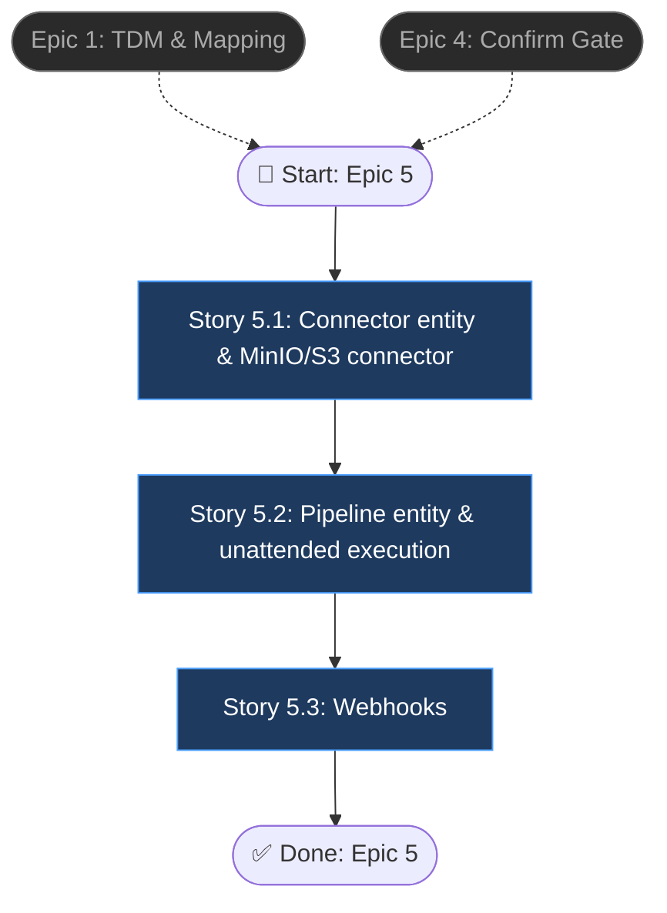

# Epic 5: Automated Pipelines (Connectors + Webhooks)

> Source PRD: `final_project_ai/docs/interactive-data-preprocessing-prd.md`

## Epic Objective

Turn the interactive importer into a repeatable operating model: data arrives via an input connector, flows through remembered header/mapping/cleaning decisions unattended, and exits to an output connector — pausing into human review only when unresolved errors exceed a threshold. Webhooks notify downstream systems of import and pipeline events without polling. This epic monetizes everything the earlier epics remembered (header signatures, mapping history, category assignments, deterministic fixers).

## Flowchart

## Stories

### Story 5.1: Connector entity & MinIO/S3 connector

As a platform operator,
I want to register input/output connectors,
so that pipelines can receive and deliver data without manual uploads.

#### Acceptance Criteria

1: `connectors` table + CRUD API/UI: name, `type: input | output`, `kind: manual | minio_s3 | ftp_sftp | http | email`, and kind-specific config; credentials are encrypted at rest and never returned by the API (write-only fields)
2: MinIO/S3 implemented first for both directions: input watches a configured bucket/prefix for new objects; output writes result files to a bucket/prefix; a "Test connection" action verifies credentials and access before saving
3: The `manual` kind wraps the interactive upload path as a pseudo-connector so a pipeline definition can start from manual uploads uniformly
4: `ftp_sftp`, `http`, `email` kinds are registered as enum values with clear "not yet implemented" responses (schema-ready, implementation deferred)
5: Unit tests: credential encryption round-trip, config validation per kind, test-connection success/failure paths

### Story 5.2: Pipeline entity & unattended execution

As a platform operator,
I want to compose input connector + TDM + saved mapping + output connector into a pipeline,
so that recurring imports run automatically.

#### Acceptance Criteria

1: `pipelines` + `pipeline_executions` tables; setup flow mirrors Ingestro: name → input connector → target data model → output connector (+ output format `csv | json | xlsx`); a pipeline is only creatable when at least one confirmed mapping (header signature) exists for the chosen TDM, otherwise the UI directs the user to run one interactive import first
2: An execution runs the import stages unattended: header auto-detect (Epic 2), historical mapping (Epic 1), deterministic cleaning only — no LLM calls by default (config can enable them); results are written through the output connector in the chosen format
3: If unresolved required-column errors exceed the configured threshold, the execution pauses with status `needs_review`, appears in the review queue, and resumes through the interactive Review Entries flow (Epic 4) — completing writes to the output connector as usual
4: Pipelines list page shows name, created by, execution count, last status, and history; filters for status/mode; a manual "Run now" trigger and an API trigger endpoint (token-authenticated) exist
5: Executions write the same lineage records as interactive imports (NFR4); a failed execution records the failing stage and error

### Story 5.3: Webhooks

As an integrating developer,
I want webhook notifications for import/pipeline events,
so that downstream systems react without polling.

#### Acceptance Criteria

1: `webhooks` table + CRUD (target URL, secret, subscribed events, active flag) with a limit of 10 per deployment; payloads are HMAC-SHA256 signed with the webhook secret (signature header documented)
2: Events emitted: `import.completed`, `import.needs_review`, `pipeline.completed`, `pipeline.failed` — each carrying ids, status, counts, and lineage reference
3: Delivery is async (Celery) with retry/backoff (e.g. 3 attempts) and a per-webhook delivery log (timestamp, status code, attempt) viewable in the UI
4: A documentation page lists payload schemas and the signature-verification recipe
5: Webhook dispatch failures never fail the import/pipeline itself (fire-and-forget with logging)

## Dependencies

- **Epic 1** (mapping history is the "saved script" pipelines replay) and **Epic 4** (confirm gate, canonical Parquet, quick-mode auto-confirm path) must be complete; Epic 2's header auto-detect and Epic 3's deterministic fixers are exercised unattended
- Encryption key management for connector credentials (env-provided key; document rotation procedure)
- Celery for connector polling/watch and webhook delivery; MinIO already available as the first connector target

## Additional Notes

- Scheduling/cron triggers are out of scope per the PRD — executions start from connector events, manual "Run now", or the API trigger (Ingestro "Dynamic Import" analogue)
- Self-hosted variants and non-MinIO cloud connectors beyond the S3 API are out of scope
- LLM usage in unattended runs is off by default deliberately: no human is present to review AI decisions, so only deterministic, previously-confirmed logic runs (consistent with the PRD's AI data-minimization posture)
- The API trigger token should reuse the platform's existing auth (JWT) rather than introducing Ingestro-style product license keys for now
