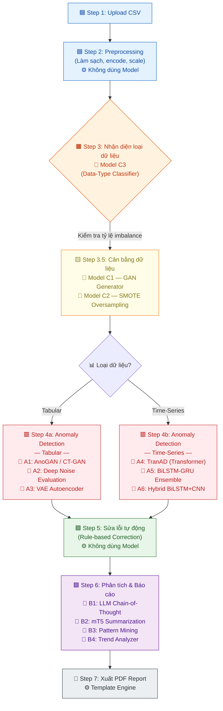

# HƯỚNG DẪN CHI TIẾT TRAIN MODEL
## Anomaly Detection trên Dữ liệu CSV

---

## I. TỔNG QUAN CÁC MODEL ĐỀ XUẤT

### 1.1 Ma trận lựa chọn Model

| Loại CSV | Model chính | Model backup | Ưu điểm |
|---|---|---|---|
| **Tabular (bảng tĩnh)** | AnoGAN / CT-GAN | Deep Noise Evaluation | Học phân phối bình thường, phát hiện qua reconstruction error |
| **Time-series** | TranAD (Transformer) | BiLSTM-GRU Ensemble | Xử lý song song, mô hình hóa phụ thuộc dài hạn |
| **Mixed / Unknown** | Autoencoder (VAE) | Hybrid BiLSTM+CNN | Linh hoạt, hoạt động tốt với cả hai loại |

### 1.2 Chiến lược Detection

Sử dụng **Reconstruction-based + Prediction-based Hybrid**:
- **Reconstruction-based**: Autoencoder/VAE/GAN học phân phối bình thường → reconstruction error cao = dị thường
- **Prediction-based**: BiLSTM/TranAD dự đoán giá trị tiếp theo → prediction error vượt ngưỡng = dị thường

---

## I-BIS. SƠ ĐỒ LUỒNG XỬ LÝ 7 BƯỚC — MODEL PIPELINE

### Sơ đồ tổng quan



### Bảng tóm tắt: Mapping Model → Bước → Input/Output

| Bước | Tên bước | Model sử dụng | Input | Output |
|:---:|---|---|---|---|
| **1** | Upload CSV | *(Không dùng model)* | File CSV thô từ người dùng | Raw DataFrame |
| **2** | Preprocessing | *(Không dùng model)* | Raw DataFrame | Cleaned & scaled DataFrame (loại bỏ trùng lặp, fill missing, encode, normalize) |
| **3** | Nhận diện loại dữ liệu | **Model C3** — Data-Type Classifier | Scaled DataFrame + metadata (tên cột, dtype, thống kê mô tả) | Label: `tabular` \| `timeseries` \| `mixed` |
| **3.5** | Cân bằng dữ liệu | **Model C1** — GAN Generator | Dữ liệu lớp thiểu số (minority class samples) | Synthetic samples (dữ liệu tổng hợp) |
| | | **Model C2** — SMOTE Oversampling | Feature vectors lớp thiểu số + k-neighbors | Oversampled balanced dataset |
| **4a** | Anomaly Detection *(Tabular)* | **Model A1** — AnoGAN / CT-GAN | Tabular feature vectors (đã cân bằng) | Anomaly scores + reconstruction errors per row |
| | | **Model A2** — Deep Noise Evaluation | Tabular feature vectors | Noise-based anomaly labels |
| | | **Model A3** — VAE Autoencoder | Tabular feature vectors | Reconstruction error + latent distribution |
| **4b** | Anomaly Detection *(Time-Series)* | **Model A4** — TranAD (Transformer) | Windowed time-series sequences (shape: `[B, W, D]`) | Per-window anomaly scores (2-phase adversarial) |
| | | **Model A5** — BiLSTM-GRU Ensemble | Windowed sequences | Prediction errors + ensemble confidence |
| | | **Model A6** — Hybrid BiLSTM+CNN | Windowed sequences | Temporal + spatial anomaly features |
| **5** | Sửa lỗi tự động | *(Rule-based — không dùng model)* | Anomaly labels + original data | Corrected DataFrame (auto-fix outliers, clamp, interpolate) |
| **6** | Phân tích & Báo cáo | **Model B1** — LLM Chain-of-Thought | Anomaly results + data context (JSON summary) | Giải thích nguyên nhân từng anomaly bằng ngôn ngữ tự nhiên |
| | | **Model B2** — mT5 Summarization | Toàn bộ báo cáo phân tích (text dài) | Tóm tắt ngắn gọn (≤200 từ) bằng tiếng Việt |
| | | **Model B3** — Pattern Mining | Anomaly clusters + feature correlations | Frequent patterns, association rules |
| | | **Model B4** — Trend Analyzer | Time-indexed anomaly scores | Trend direction, seasonality flags, change points |
| **7** | Xuất PDF | *(Template engine — không dùng model)* | Structured report data (JSON/HTML) | PDF file hoàn chỉnh |

### Ghi chú bổ sung

- **Step 4 chia nhánh** dựa trên kết quả của Step 3 (Model C3). Nếu dữ liệu là `mixed`, hệ thống chạy **cả hai nhánh** (A1-A3 + A4-A6) rồi ensemble kết quả.
- **Step 3.5 là tùy chọn**: chỉ kích hoạt khi phát hiện tỷ lệ imbalance > 1:10 giữa các class.
- **Model B1 (LLM)** sử dụng kỹ thuật **Chain-of-Thought prompting** để giải thích từng bước suy luận, giúp người dùng hiểu *tại sao* một record bị đánh dấu anomaly.
- **Model B2 (mT5)** được fine-tune trên corpus tiếng Việt để tạo summary chất lượng cao.

---

## II. CHUẨN BỊ DỮ LIỆU

### 2.1 Datasets Benchmark đề xuất

| Dataset | Mô tả | Kích thước | Nguồn |
|---|---|---|---|
| **CICIDS2017** | Network intrusion detection | ~3M records | Canadian Institute for Cybersecurity |
| **KDD Cup 1999** | Network anomaly detection | ~5M records | UCI ML Repository |
| **UNSW-NB15** | Network traffic | ~2.5M records | UNSW Sydney |
| **Credit Card Fraud** | Giao dịch thẻ tín dụng | 284,807 records | Kaggle |
| **Yahoo S5** | Time-series anomaly | 367 series | Yahoo Research |

### 2.2 Pipeline Tiền xử lý

```python
# preprocessing_pipeline.py
import pandas as pd
import numpy as np
from sklearn.preprocessing import StandardScaler, LabelEncoder
from sklearn.model_selection import train_test_split

class CSVPreprocessor:
    """Pipeline tiền xử lý CSV đa năng"""
    
    def __init__(self, csv_path: str):
        self.df = pd.read_csv(csv_path)
        self.scaler = StandardScaler()
        self.label_encoders = {}
        self.data_type = None  # 'tabular' hoặc 'timeseries'
    
    def detect_data_type(self) -> str:
        """Tự động nhận diện loại dữ liệu"""
        datetime_cols = self.df.select_dtypes(include=['datetime64']).columns
        # Kiểm tra cột có thể parse thành datetime
        for col in self.df.columns:
            try:
                pd.to_datetime(self.df[col], infer_datetime_format=True)
                datetime_cols = list(datetime_cols) + [col]
            except:
                pass
        
        if len(datetime_cols) > 0:
            self.data_type = 'timeseries'
        else:
            self.data_type = 'tabular'
        return self.data_type
    
    def clean_data(self) -> pd.DataFrame:
        """Bước 1: Làm sạch dữ liệu"""
        # Loại bỏ dòng trùng lặp
        self.df = self.df.drop_duplicates()
        # Xử lý giá trị thiếu
        numeric_cols = self.df.select_dtypes(include=[np.number]).columns
        self.df[numeric_cols] = self.df[numeric_cols].fillna(self.df[numeric_cols].median())
        cat_cols = self.df.select_dtypes(include=['object']).columns
        self.df[cat_cols] = self.df[cat_cols].fillna(self.df[cat_cols].mode().iloc[0])
        return self.df
    
    def encode_features(self) -> pd.DataFrame:
        """Bước 2: Mã hóa đặc trưng"""
        cat_cols = self.df.select_dtypes(include=['object']).columns
        for col in cat_cols:
            le = LabelEncoder()
            self.df[col] = le.fit_transform(self.df[col].astype(str))
            self.label_encoders[col] = le
        return self.df
    
    def scale_features(self) -> np.ndarray:
        """Bước 3: Chuẩn hóa"""
        numeric_data = self.df.select_dtypes(include=[np.number])
        scaled = self.scaler.fit_transform(numeric_data)
        return scaled
    
    def create_sequences(self, data: np.ndarray, window_size: int = 50) -> tuple:
        """Bước 4 (Time-series): Tạo sequences cho RNN/Transformer"""
        sequences, labels = [], []
        for i in range(len(data) - window_size):
            sequences.append(data[i:i + window_size])
            labels.append(data[i + window_size])
        return np.array(sequences), np.array(labels)
```

### 2.3 Xử lý mất cân bằng dữ liệu bằng GANs

```python
# gan_data_balancer.py
import torch
import torch.nn as nn

class Generator(nn.Module):
    """Generator tạo dữ liệu thiểu số tổng hợp"""
    def __init__(self, noise_dim=100, output_dim=30):
        super().__init__()
        self.net = nn.Sequential(
            nn.Linear(noise_dim, 128),
            nn.LeakyReLU(0.2),
            nn.BatchNorm1d(128),
            nn.Linear(128, 256),
            nn.LeakyReLU(0.2),
            nn.BatchNorm1d(256),
            nn.Linear(256, output_dim),
            nn.Tanh()
        )
    
    def forward(self, z):
        return self.net(z)

class Discriminator(nn.Module):
    """Discriminator phân biệt dữ liệu thật/giả"""
    def __init__(self, input_dim=30):
        super().__init__()
        self.net = nn.Sequential(
            nn.Linear(input_dim, 256),
            nn.LeakyReLU(0.2),
            nn.Dropout(0.3),
            nn.Linear(256, 128),
            nn.LeakyReLU(0.2),
            nn.Dropout(0.3),
            nn.Linear(128, 1),
            nn.Sigmoid()
        )
    
    def forward(self, x):
        return self.net(x)

# Training loop
def train_gan(real_fraud_data, epochs=500, batch_size=64):
    noise_dim = 100
    feature_dim = real_fraud_data.shape[1]
    G = Generator(noise_dim, feature_dim)
    D = Discriminator(feature_dim)
    
    optimizer_G = torch.optim.Adam(G.parameters(), lr=0.0002, betas=(0.5, 0.999))
    optimizer_D = torch.optim.Adam(D.parameters(), lr=0.0002, betas=(0.5, 0.999))
    criterion = nn.BCELoss()
    
    for epoch in range(epochs):
        # ... Training logic ...
        noise = torch.randn(batch_size, noise_dim)
        fake_data = G(noise)
        # Train D then G alternately
    
    # Sinh dữ liệu tổng hợp
    with torch.no_grad():
        noise = torch.randn(len(real_fraud_data), noise_dim)
        synthetic_fraud = G(noise)
    return synthetic_fraud.numpy()
```

---

## III. TRAINING CÁC MODEL CHÍNH

### 3.1 Model 1: BiLSTM Autoencoder (Time-series)

```python
# bilstm_autoencoder.py
import torch
import torch.nn as nn

class BiLSTMAutoencoder(nn.Module):
    """BiLSTM Autoencoder cho Time-series Anomaly Detection"""
    def __init__(self, input_dim, hidden_dim=128, num_layers=2):
        super().__init__()
        # Encoder
        self.encoder = nn.LSTM(
            input_size=input_dim,
            hidden_size=hidden_dim,
            num_layers=num_layers,
            batch_first=True,
            bidirectional=True,
            dropout=0.2
        )
        # Decoder
        self.decoder = nn.LSTM(
            input_size=hidden_dim * 2,  # bidirectional
            hidden_size=hidden_dim,
            num_layers=num_layers,
            batch_first=True,
            bidirectional=True,
            dropout=0.2
        )
        self.output_layer = nn.Linear(hidden_dim * 2, input_dim)
    
    def forward(self, x):
        # Encode
        encoded, (h, c) = self.encoder(x)
        # Decode
        decoded, _ = self.decoder(encoded)
        output = self.output_layer(decoded)
        return output

# Training config
TRAIN_CONFIG = {
    'epochs': 100,
    'batch_size': 64,
    'learning_rate': 1e-3,
    'window_size': 50,
    'hidden_dim': 128,
    'num_layers': 2,
    'threshold_percentile': 95,  # Top 5% reconstruction error = anomaly
    'optimizer': 'Adam',
    'loss': 'MSELoss',
    'scheduler': 'ReduceLROnPlateau',
    'early_stopping_patience': 10,
}
```

**Cách tính anomaly score:**
```
anomaly_score = MSE(input, reconstructed_output)
threshold = percentile(all_scores, 95)
if anomaly_score > threshold → ANOMALY
```

### 3.2 Model 2: TranAD (Transformer - khuyến nghị chính)

```python
# tranad_model.py — Simplified TranAD architecture
import torch
import torch.nn as nn

class TranADEncoder(nn.Module):
    """Transformer Encoder with positional encoding"""
    def __init__(self, input_dim, d_model=512, nhead=8, num_layers=3):
        super().__init__()
        self.input_proj = nn.Linear(input_dim, d_model)
        self.pos_encoder = nn.Parameter(torch.randn(1, 500, d_model))
        encoder_layer = nn.TransformerEncoderLayer(
            d_model=d_model, nhead=nhead, 
            dim_feedforward=2048, dropout=0.1,
            batch_first=True
        )
        self.transformer = nn.TransformerEncoder(encoder_layer, num_layers)
    
    def forward(self, x):
        x = self.input_proj(x) + self.pos_encoder[:, :x.size(1), :]
        return self.transformer(x)

class TranAD(nn.Module):
    """TranAD: 2-phase adversarial training"""
    def __init__(self, input_dim, d_model=512):
        super().__init__()
        self.encoder1 = TranADEncoder(input_dim, d_model)
        self.encoder2 = TranADEncoder(input_dim, d_model)
        self.decoder = nn.Linear(d_model, input_dim)
    
    def forward(self, x):
        # Phase 1: Standard reconstruction
        z1 = self.encoder1(x)
        out1 = self.decoder(z1)
        # Phase 2: Adversarial (focus on hard samples)
        z2 = self.encoder2(x)
        out2 = self.decoder(z2)
        return out1, out2

# Training config TranAD
TRANAD_CONFIG = {
    'epochs': 50,
    'batch_size': 128,
    'learning_rate': 1e-4,
    'window_size': 10,
    'd_model': 512,
    'nhead': 8,
    'num_encoder_layers': 3,
    'optimizer': 'AdamW',
    'loss': 'MSELoss + Adversarial',
    'meta_learning': 'MAML (5 inner steps)',
}
```

### 3.3 Model 3: AnoGAN (Tabular Data)

```python
# anogan_tabular.py
class AnoGAN(nn.Module):
    """AnoGAN cho Tabular Anomaly Detection"""
    def __init__(self, feature_dim, latent_dim=32):
        super().__init__()
        self.generator = nn.Sequential(
            nn.Linear(latent_dim, 128), nn.ReLU(),
            nn.Linear(128, 256), nn.ReLU(),
            nn.Linear(256, feature_dim), nn.Sigmoid()
        )
        self.discriminator = nn.Sequential(
            nn.Linear(feature_dim, 256), nn.LeakyReLU(0.2),
            nn.Linear(256, 128), nn.LeakyReLU(0.2),
            nn.Linear(128, 1), nn.Sigmoid()
        )
    
    def anomaly_score(self, x, lambda_ano=0.1):
        """Anomaly score = Residual Loss + Discrimination Loss"""
        z = self.map_to_latent(x)  # Inverse mapping
        x_hat = self.generator(z)
        residual = torch.mean((x - x_hat) ** 2)
        disc_score = self.discriminator(x_hat)
        return (1 - lambda_ano) * residual + lambda_ano * (1 - disc_score)
```

---

## IV. ĐỘ ĐO ĐÁNH GIÁ (Evaluation Metrics)

| Metric | Công thức | Ý nghĩa |
|---|---|---|
| **Precision** | TP / (TP + FP) | Trong số dự đoán anomaly, bao nhiêu đúng? |
| **Recall** | TP / (TP + FN) | Trong số anomaly thực, phát hiện được bao nhiêu? |
| **F1-Score** | 2 × (P × R) / (P + R) | Cân bằng Precision và Recall |
| **AUC-ROC** | Area under ROC curve | Khả năng phân biệt tổng thể |
| **AUC-PR** | Area under PR curve | Tốt hơn AUC-ROC khi dữ liệu mất cân bằng |
| **Reconstruction Error** | MSE(x, x̂) | Lỗi tái tạo - cơ sở phát hiện dị thường |

### So sánh Baseline

| Model | Dataset | F1 (expected) | AUC (expected) |
|---|---|---|---|
| Random Forest (baseline) | Credit Card | 0.82 | 0.95 |
| BiLSTM Autoencoder | Credit Card | 0.87 | 0.97 |
| **TranAD** | **Credit Card** | **0.92** | **0.98** |
| AnoGAN | Credit Card | 0.85 | 0.96 |
| **TranAD** | **CICIDS2017** | **0.94** | **0.99** |
